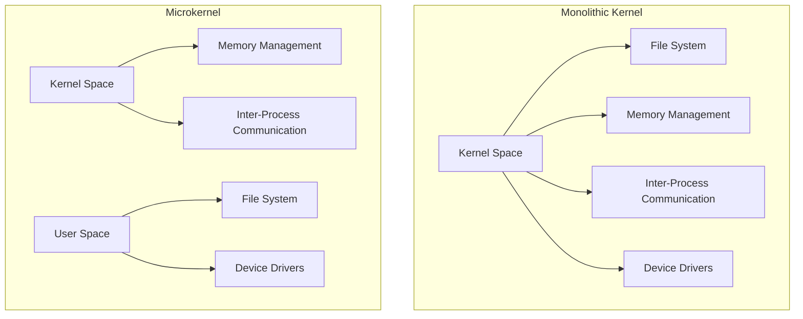

import { Callout, Steps, Step } from "nextra-theme-docs";

# Kernel Architectures

The kernel is the core component of an operating system, responsible for managing system resources, providing an interface between hardware and software, and enforcing security policies. The architecture of the kernel plays a crucial role in determining the overall performance, stability, and security of the operating system.

There are two main types of kernel architectures:

1. [Monolithic Kernel](/cpu-features-and-kernel-architectures/kernel-architectures/monolithic-kernel)
2. [Microkernel](/cpu-features-and-kernel-architectures/kernel-architectures/microkernel)

<Callout type="info">
The choice of kernel architecture depends on factors such as the intended use of the operating system, performance requirements, and security considerations.
</Callout>

## Monolithic Kernel vs. Microkernel

The main difference between monolithic kernels and microkernels lies in the way they organize and manage system services:

- In a monolithic kernel, all system services run within the kernel space, which results in a larger kernel size but generally offers better performance.
- In a microkernel, only essential services run within the kernel space, while other services run as separate processes in user space, resulting in a smaller kernel size and potentially better stability and security.

The following diagram illustrates the differences between monolithic and microkernel architectures:

<Steps>
### Step 1

Consider the requirements of your operating system, such as performance, security, and stability.

### Step 2

Choose the appropriate kernel architecture based on these requirements:
- For high-performance systems, a monolithic kernel may be more suitable.
- For systems that prioritize stability and security, a microkernel architecture may be a better choice.
</Steps>

The choice of kernel architecture affects various aspects of the operating system, such as:

- **Performance**: Monolithic kernels generally offer better performance due to reduced context switching and communication overhead between system services.
- **Security**: Microkernels provide better isolation between system services, which can help contain the impact of security vulnerabilities.
- **Stability**: In a microkernel, a crash in one system service is less likely to bring down the entire system compared to a monolithic kernel.

<Callout type="warning">
It's important to note that the distinction between monolithic kernels and microkernels is not always clear-cut. Many modern operating systems employ hybrid approaches, incorporating elements of both architectures to strike a balance between performance, security, and stability.
</Callout>

In the following subsections, we will delve deeper into the specifics of [monolithic kernels](/cpu-features-and-kernel-architectures/kernel-architectures/monolithic-kernel) and [microkernels](/cpu-features-and-kernel-architectures/kernel-architectures/microkernel), examining their strengths, weaknesses, and real-world examples.