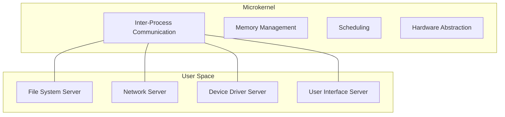

import { Callout, Steps, Step } from "nextra-theme-docs";

# Microkernel

A microkernel is a type of kernel architecture that aims to minimize the kernel's size and complexity by moving as many services and drivers as possible into user space. This approach contrasts with the monolithic kernel architecture, where all operating system services and drivers are integrated into the kernel itself.

## Key Features of Microkernels

- **Minimal kernel size**: Microkernels typically contain less than 10,000 lines of code, making them smaller and more manageable than monolithic kernels.
- **Modular design**: Operating system functions are divided between the kernel and a set of servers that run in user space, promoting a modular and flexible system architecture.
- **Improved stability**: By isolating services and drivers in user space, a fault in one component is less likely to crash the entire system.
- **Increased security**: The reduced kernel size and isolation of components make it easier to audit and secure the system.

<Callout type="info">
Microkernels are often used in embedded systems and real-time operating systems, where reliability and predictability are critical.
</Callout>

## Microkernel Architecture

The microkernel architecture consists of two main components:

1. The microkernel itself, which provides basic services such as:
   - Inter-process communication (IPC)
   - Memory management
   - Scheduling
   - Low-level hardware abstraction

2. User space servers, which handle higher-level operating system functions, such as:
   - Device drivers
   - File systems
   - Network protocols
   - User interface components

## Advantages and Disadvantages

Microkernels offer several advantages, such as improved stability, security, and modularity. However, they also have some drawbacks:

- **Performance overhead**: The increased number of user-kernel mode switches and IPC between components can lead to performance degradation compared to monolithic kernels.
- **Complexity**: Designing and implementing a microkernel-based system can be more complex than a monolithic kernel due to the distributed nature of the architecture.

## Examples of Microkernel-based Operating Systems

Some notable operating systems that use a microkernel architecture include:

- [QNX](/qnx): A real-time operating system used in automotive, medical, and industrial applications.
- [seL4](/sel4): A formally verified microkernel designed for safety-critical systems.
- [Minix](/minix): A Unix-like operating system used for educational purposes and research.

<Callout type="info">
Many modern operating systems, such as [macOS](/macos) and [Windows NT](/windows-nt), incorporate elements of both microkernel and monolithic kernel architectures, resulting in hybrid kernel designs that aim to balance performance and modularity.
</Callout>