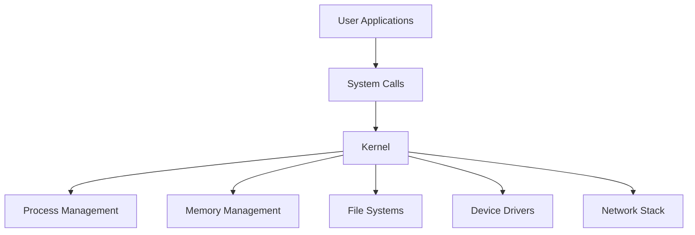

import { Callout, Steps, Step } from "nextra-theme-docs";

# Monolithic Kernel

A monolithic kernel is an architecture where the entire operating system runs as a single program in kernel mode. It is a large, complex, and tightly coupled system where all the operating system services, such as process management, memory management, file systems, and device drivers, are built into the kernel.

## Advantages of Monolithic Kernels

1. **Performance**: Monolithic kernels offer better performance compared to other architectures, as all the components are tightly integrated and can communicate efficiently.

2. **Simplicity**: Monolithic kernels are simpler to design and implement, as there is no need to define strict boundaries between different components.

3. **Compatibility**: Monolithic kernels are compatible with a wide range of hardware and software, as all the necessary drivers and services are included in the kernel.

## Disadvantages of Monolithic Kernels

1. **Stability**: A bug in any part of the kernel can crash the entire system, making monolithic kernels less stable compared to other architectures.

2. **Maintainability**: Monolithic kernels are difficult to maintain and modify, as changes in one part of the kernel can have unintended consequences in other parts.

3. **Security**: Monolithic kernels are more vulnerable to security threats, as a single exploit can compromise the entire system.

<Callout type="info">
Examples of operating systems that use a monolithic kernel architecture include Linux, BSD, and some versions of Windows (such as Windows 95 and Windows 98).
</Callout>

## Monolithic Kernel Structure

The structure of a monolithic kernel can be represented using the following diagram:

In a monolithic kernel, all the components are compiled into a single binary, and they operate in the same address space. This allows for efficient communication between different parts of the kernel, but it also makes the kernel more complex and prone to errors.

## Comparison with Microkernel Architecture

Monolithic kernels are often compared to [microkernels](/cpu-features-and-kernel-architectures/kernel-architectures/microkernel), which have a minimal kernel that provides only the most essential services, while other components run as separate processes in user mode.

<Steps>

### Step 1
Consider the specific requirements of your operating system, such as performance, security, and maintainability.

### Step 2
Evaluate the trade-offs between monolithic kernels and microkernels, and choose the architecture that best suits your needs.

</Steps>

In conclusion, monolithic kernels offer better performance and simplicity, but they are less stable, harder to maintain, and more vulnerable to security threats compared to microkernels. The choice between a monolithic kernel and a microkernel depends on the specific requirements of the operating system and the trade-offs that the designers are willing to make.