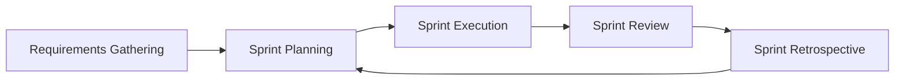

import { Callout, Steps, Step } from "nextra-theme-docs";

# Agile Model

The Agile model is a popular approach to software development that emphasizes flexibility, collaboration, and iterative progress. Unlike the traditional [Waterfall model](/development-cycles-and-requirements-analysis/development-cycles/waterfall-model), which follows a linear and sequential process, the Agile model adapts to changing requirements and delivers working software in shorter cycles called sprints.

## Key Principles of Agile

The Agile model is based on the following key principles:

- **Individuals and Interactions:** Agile prioritizes people and their interactions over processes and tools.
- **Working Software:** Delivering functional software is the primary measure of progress in Agile.
- **Customer Collaboration:** Agile encourages close collaboration with customers throughout the development process.
- **Responding to Change:** Agile welcomes and adapts to changes in requirements, even late in the development cycle.

<Callout type="info">
The Agile Manifesto, written in 2001, outlines the core values and principles of Agile software development.
</Callout>

## Agile Methodologies

There are several methodologies that fall under the Agile umbrella, each with its own set of practices and frameworks. Some popular Agile methodologies include:

- **Scrum:** A framework that emphasizes teamwork, accountability, and iterative progress.
- **Kanban:** A method that focuses on visualizing work, limiting work in progress, and optimizing flow.
- **Extreme Programming (XP):** A methodology that emphasizes practices such as pair programming, test-driven development, and continuous integration.

<Steps>
### Step 1: Sprint Planning

At the beginning of each sprint, the team holds a sprint planning meeting to define the goals and tasks for the upcoming iteration.

### Step 2: Daily Stand-up

During the sprint, the team conducts daily stand-up meetings to discuss progress, challenges, and plans for the day.

### Step 3: Sprint Review

At the end of the sprint, the team demonstrates the working software to stakeholders and gathers feedback.

### Step 4: Sprint Retrospective

The team reflects on the completed sprint, identifies areas for improvement, and plans for the next iteration.
</Steps>

## Benefits of Agile

Agile offers several benefits over traditional development methodologies:

- **Faster Time to Market:** Agile allows teams to deliver working software in shorter iterations, enabling faster time to market.
- **Increased Flexibility:** Agile accommodates changes in requirements, allowing teams to adapt to evolving customer needs.
- **Improved Collaboration:** Agile fosters collaboration among team members, stakeholders, and customers, leading to better communication and alignment.
- **Higher Customer Satisfaction:** Agile involves customers throughout the development process, ensuring that the final product meets their expectations.

The Agile model is well-suited for projects with rapidly changing requirements and a need for frequent customer feedback. By embracing Agile principles and practices, teams can deliver high-quality software incrementally, while maintaining flexibility and responsiveness to change.

$Agile = Flexibility + Collaboration + Iterative Progress$

For more information on Agile methodologies, you can explore the following subsections:
- [Scrum](/agile-methodologies/scrum)
- [Kanban](/agile-methodologies/kanban)
- [Extreme Programming (XP)](/agile-methodologies/extreme-programming)