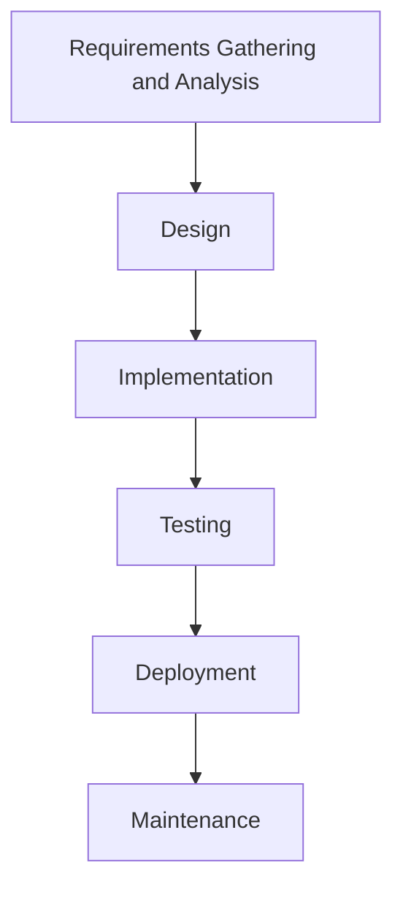

import { Callout, Steps, Step } from "nextra-theme-docs";

# Waterfall Model

The waterfall model is a traditional approach to software development that follows a linear, sequential process. It is called the "waterfall" model because the stages of development flow downwards, like a waterfall, from one stage to the next.

<Callout type="info">
The waterfall model is best suited for projects with well-defined requirements and a clear understanding of the end goal.
</Callout>

## Stages of the Waterfall Model

<Steps>
### Step 1: Requirements Gathering and Analysis

In this stage, the project requirements are gathered and documented. The development team works closely with the stakeholders to understand their needs and expectations.

### Step 2: Design

Once the requirements are finalized, the system architecture and design are created. This includes the overall system structure, database design, user interface design, and more.

### Step 3: Implementation

The actual coding and development of the software take place in this stage. Developers follow the design specifications and write code to implement the required functionality.

### Step 4: Testing

After the implementation is complete, the software undergoes thorough testing to identify and fix any bugs or issues. This stage includes unit testing, integration testing, and system testing.

### Step 5: Deployment

Once the software has passed all the tests, it is deployed to the production environment. This stage may also include user training and documentation.

### Step 6: Maintenance

After the software is deployed, ongoing maintenance and support are provided to ensure its smooth operation and address any issues that may arise.
</Steps>

## Advantages of the Waterfall Model

- Easy to understand and manage due to its linear structure
- Well-defined stages and milestones
- Suitable for projects with clear and stable requirements
- Emphasizes documentation and planning

## Disadvantages of the Waterfall Model

- Inflexible and resistant to changes in requirements
- Delays in early stages can cause cascading delays in later stages
- Lacks customer feedback until the end of the development cycle
- Difficult to accommodate changes or iterate on the product

<Callout type="warning">
The waterfall model may not be the best choice for projects with rapidly changing requirements or those that require frequent customer feedback and iteration.
</Callout>

For more information on alternative development models, check out the [Agile Model](/development-cycles-and-requirements-analysis/development-cycles/agile-model) section.