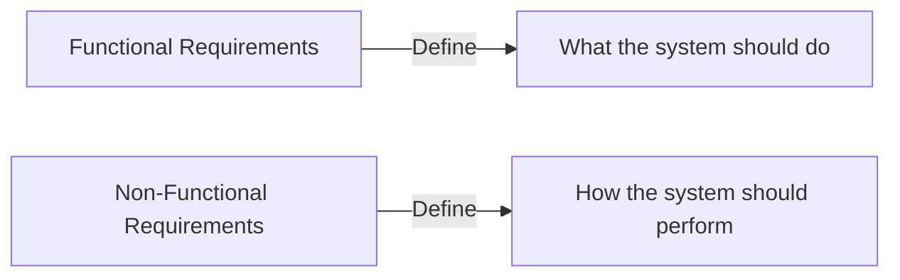

import { Callout, Steps, Step } from "nextra-theme-docs";

# Non-Functional Requirements

Non-functional requirements, also known as quality attributes, are the criteria that specify how a system should perform, rather than what it should do. These requirements focus on the overall qualities and characteristics of the system, such as usability, reliability, performance, and maintainability. While functional requirements define the specific functions and features of a system, non-functional requirements ensure that the system meets the desired quality standards and user expectations.

## Categories of Non-Functional Requirements

Non-functional requirements can be classified into several categories, including:

- **Usability**: The system should be easy to learn, use, and navigate. It should provide a user-friendly interface and clear documentation.
- **Reliability**: The system should be stable, consistent, and capable of handling errors and failures gracefully. It should have minimal downtime and data loss.
- **Performance**: The system should respond quickly to user requests, process data efficiently, and handle a specified load without significant degradation.
- **Scalability**: The system should be able to accommodate growth in users, data, or functionality without compromising performance.
- **Security**: The system should protect sensitive information, prevent unauthorized access, and ensure data integrity and confidentiality.
- **Maintainability**: The system should be easy to modify, update, and extend. It should have a modular design and clear documentation to facilitate maintenance tasks.

<Callout type="info">
Non-functional requirements are often described using the acronym "URPS," which stands for Usability, Reliability, Performance, and Supportability (which includes maintainability, scalability, and security).
</Callout>

## Importance of Non-Functional Requirements

Non-functional requirements are crucial for the success of a software system because they directly impact the user experience and the overall quality of the system. Here's why they are important:

1. **User Satisfaction**: Non-functional requirements, such as usability and performance, directly influence user satisfaction. A system that is difficult to use or performs poorly will lead to frustration and dissatisfaction among users.

2. **System Reliability**: Non-functional requirements related to reliability ensure that the system is stable, consistent, and available when needed. A reliable system builds trust with users and minimizes the risk of data loss or system failure.

3. **Competitive Advantage**: Meeting or exceeding non-functional requirements can give a software system a competitive edge in the market. Users are more likely to choose a system that offers better performance, usability, and security over its competitors.

4. **Long-term Maintainability**: Non-functional requirements related to maintainability ensure that the system can be easily modified, updated, and extended over time. This is crucial for the long-term success and evolution of the software system.

## Specifying Non-Functional Requirements

When specifying non-functional requirements, it's important to follow these guidelines:

<Steps>

### Be Specific and Measurable

Non-functional requirements should be specific and measurable. Use quantitative metrics whenever possible to define the desired quality attributes. For example, instead of stating "the system should be fast," specify "the system should respond to user requests within 2 seconds."

### Prioritize Requirements

Prioritize non-functional requirements based on their importance to the stakeholders and the overall system goals. This helps in making trade-off decisions during development and ensuring that the most critical requirements are met.

### Use Scenarios and Examples

Use scenarios and examples to illustrate the desired behavior and quality attributes of the system. This helps in communicating the requirements effectively to the development team and stakeholders.

### Review and Validate

Review and validate the non-functional requirements with stakeholders to ensure that they accurately reflect their needs and expectations. Regularly revisit and update the requirements throughout the development process to accommodate any changes or new insights.

</Steps>

## Examples of Non-Functional Requirements

Here are a few examples of non-functional requirements:

- The system should have an uptime of at least 99.9% during peak usage hours.
- The system should be able to handle 1,000 concurrent users without performance degradation.
- The system should adhere to [WCAG 2.1](https://www.w3.org/TR/WCAG21/) accessibility guidelines to ensure usability for users with disabilities.
- The system should enforce strong password policies and implement two-factor authentication for enhanced security.
- The system should be modular and follow a layered architecture to facilitate maintainability and extensibility.

By carefully considering and specifying non-functional requirements, software teams can ensure that the system meets the desired quality standards and delivers a positive user experience. Remember, non-functional requirements are just as important as functional requirements in shaping the success of a software system.

For more information on specific non-functional requirements, check out the following sections:

- [Usability](/development-cycles-and-requirements-analysis/requirements-analysis/non-functional-requirements/usability)
- [Reliability](/development-cycles-and-requirements-analysis/requirements-analysis/non-functional-requirements/reliability)
- [Performance](/development-cycles-and-requirements-analysis/requirements-analysis/non-functional-requirements/performance)
- [Security](/development-cycles-and-requirements-analysis/requirements-analysis/non-functional-requirements/security)
- [Maintainability](/development-cycles-and-requirements-analysis/requirements-analysis/non-functional-requirements/maintainability)