import { Callout, Steps, Step } from "nextra-theme-docs";

# CPU Scheduling

CPU scheduling is the process of allocating CPU time to different processes in a computer system. The main goal of CPU scheduling is to maximize CPU utilization while ensuring fairness and minimizing the average waiting time for processes.

## Scheduling Algorithms

There are several scheduling algorithms used by operating systems to determine which process should be executed next by the CPU. Some of the most common algorithms include:

### First-Come, First-Served (FCFS)

The FCFS algorithm schedules processes in the order they arrive. The process that requests the CPU first is allocated the CPU first. This algorithm is simple to implement but can lead to long waiting times for processes that arrive later.

### Shortest Job First (SJF)

The SJF algorithm schedules processes based on their estimated execution time. The process with the shortest estimated execution time is allocated the CPU first. This algorithm can minimize the average waiting time but requires accurate estimates of process execution times.

### Priority Scheduling

Priority scheduling assigns a priority to each process and schedules processes based on their priority. Higher priority processes are executed before lower priority processes. This algorithm can ensure that critical processes are executed promptly but may lead to starvation of lower priority processes.

### Round Robin (RR)

The RR algorithm allocates a fixed time slice (quantum) to each process in a cyclic manner. Each process is executed for the duration of the time slice, and if it does not complete within that time, it is preempted and added to the end of the ready queue. This algorithm ensures fairness and prevents starvation but may lead to higher context switching overhead.

<Callout type="info">
The choice of scheduling algorithm depends on the specific requirements of the operating system and the workload characteristics. Some systems may use a combination of algorithms to achieve the desired performance and fairness.
</Callout>

## Context Switching

Context switching is the process of saving the state of a process and restoring the state of another process when the CPU is switched from one process to another. The state of a process includes its program counter, register values, and other relevant data.

<Steps>

### Step 1
Save the state of the currently running process.

### Step 2
Load the state of the next process to be executed.

### Step 3
Switch the CPU to the context of the new process.

</Steps>

Context switching is an overhead that occurs during process scheduling and can impact system performance if it happens frequently.

## Dispatcher

The dispatcher is the component of the operating system responsible for the actual context switching and transferring control of the CPU to the selected process. It performs the following tasks:

- Switching context
- Switching to user mode
- Jumping to the proper location in the user program to resume execution

The dispatcher should be as fast as possible to minimize the overhead of context switching.

## Performance Metrics

Several performance metrics are used to evaluate the effectiveness of CPU scheduling algorithms:

- **CPU utilization**: The percentage of time the CPU is busy executing processes.
- **Throughput**: The number of processes completed per unit time.
- **Turnaround time**: The total time taken from the submission of a process to its completion.
- **Waiting time**: The amount of time a process spends waiting in the ready queue.
- **Response time**: The time it takes from the submission of a process until the first response is produced.

A good scheduling algorithm should aim to maximize CPU utilization and throughput while minimizing turnaround time, waiting time, and response time.

## Gantt Charts

Gantt charts are a useful tool for visualizing the execution of processes and analyzing the performance of scheduling algorithms. They represent the allocation of CPU time to different processes over time.

```mermaid
gantt
    title CPU Scheduling Gantt Chart
    dateFormat  s
    axisFormat %S

    section Process 1
    Executing : 0, 2
    Waiting   : 2, 4
    Executing : 6, 3

    section Process 2
    Waiting   : 0, 6
    Executing : 6, 4
```

In the above Gantt chart, we can see the execution and waiting times of two processes. Process 1 executes for 2 seconds, waits for 4 seconds, and then executes again for 3 seconds. Process 2 waits for 6 seconds and then executes for 4 seconds.

## Real-Time Scheduling

Real-time systems have strict timing constraints and require specialized scheduling algorithms to ensure that deadlines are met. Two common real-time scheduling algorithms are:

- **Rate Monotonic Scheduling (RMS)**: RMS assigns priorities to processes based on their periods. Processes with shorter periods are given higher priorities.
- **Earliest Deadline First (EDF)**: EDF schedules processes based on their deadlines. The process with the earliest deadline is scheduled first.

Real-time scheduling algorithms must guarantee that processes complete their execution before their deadlines to ensure the correct functioning of the system.

<Callout type="warning">
Real-time scheduling is crucial in systems with hard real-time requirements, such as aircraft control systems or medical devices, where missing a deadline can have severe consequences.
</Callout>

## Conclusion

CPU scheduling is a fundamental concept in operating systems that aims to efficiently allocate CPU time to processes while ensuring fairness and minimizing waiting times. Various scheduling algorithms, such as FCFS, SJF, priority scheduling, and round robin, are used based on the specific requirements of the system.

Context switching and the dispatcher play important roles in the scheduling process, and performance metrics like CPU utilization, throughput, turnaround time, waiting time, and response time are used to evaluate the effectiveness of scheduling algorithms.

Real-time systems have additional scheduling requirements to meet strict timing constraints, and specialized algorithms like RMS and EDF are used in such cases.

Understanding CPU scheduling is essential for designing and optimizing operating systems to achieve the desired performance and responsiveness.

## Related Sections

- [CPU Architecture](/hardware-resources/cpu/cpu-architecture)
- [Processes](/process-management/processes)
- [Process Management Techniques](/process-management/process-management-techniques)