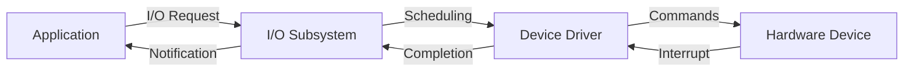

import { Callout, Steps, Step } from "nextra-theme-docs";

# I/O Software

I/O software plays a crucial role in managing I/O devices and facilitating communication between the operating system and hardware components. It acts as an intermediary layer, abstracting the complexities of hardware interfaces and providing a standardized way for applications to interact with I/O devices.

## Device Drivers

Device drivers are an essential component of I/O software. They are specialized programs that enable the operating system to communicate with specific hardware devices. Each device, such as a printer, keyboard, or network card, requires a corresponding device driver to function properly.

<Callout type="info">
Device drivers are typically provided by hardware manufacturers and are specific to the operating system and device model.
</Callout>

Device drivers perform the following tasks:
- **Initialization**: Configure the device and prepare it for use.
- **Data transfer**: Facilitate data exchange between the device and the operating system.
- **Interrupt handling**: Respond to interrupts generated by the device.
- **Error handling**: Detect and handle device-specific errors.

## I/O Subsystem

The I/O subsystem is responsible for managing and coordinating I/O operations within the operating system. It provides a consistent interface for applications to access I/O devices and handles the scheduling and execution of I/O requests.

<Steps>
### Step 1: I/O Request

An application initiates an I/O request by making a system call to the operating system. The request specifies the device, operation type (read/write), and data involved.

### Step 2: I/O Scheduling

The I/O subsystem schedules the I/O request based on factors such as priority, fairness, and optimization goals. It determines the order in which requests are processed to maximize efficiency and minimize delays.

### Step 3: Device Driver Interaction

The I/O subsystem forwards the request to the appropriate device driver. The device driver translates the request into device-specific commands and initiates the communication with the hardware device.

### Step 4: Data Transfer

The device driver manages the data transfer between the device and main memory. It ensures that data is properly transferred and handles any necessary buffering or caching mechanisms.

### Step 5: Interrupt Handling

Once the I/O operation is complete, the device generates an interrupt to notify the CPU. The interrupt handler in the device driver processes the interrupt, retrieves the result of the operation, and notifies the I/O subsystem.

### Step 6: Completion and Notification

The I/O subsystem receives the completion notification from the device driver. It updates the status of the I/O request and notifies the requesting application that the operation has been completed.
</Steps>

Here's a simplified diagram illustrating the interaction between the I/O subsystem, device drivers, and hardware devices:

## Performance Optimization

I/O software employs various techniques to optimize performance and minimize overhead. Some common optimization strategies include:

- **Buffering**: Buffering involves temporarily storing data in memory buffers to reduce the frequency of I/O operations and improve throughput.

- **Caching**: Caching keeps frequently accessed data in high-speed memory to reduce the need for slower disk I/O operations.

- **Asynchronous I/O**: Asynchronous I/O allows applications to initiate I/O requests without waiting for their completion, enabling overlapping of computation and I/O operations.

- **Direct Memory Access (DMA)**: DMA enables devices to transfer data directly to or from main memory without CPU intervention, freeing up CPU cycles for other tasks.

<Callout type="warning">
Implementing efficient I/O software is crucial for overall system performance, as I/O operations are often the bottleneck in computer systems.
</Callout>

By abstracting hardware details, providing consistent interfaces, and optimizing performance, I/O software plays a vital role in enabling smooth and efficient interaction between applications and I/O devices in an operating system.

For more information on related topics, see:
- [Memory Management](/hardware-resources/memory/memory-management)
- [CPU Scheduling](/hardware-resources/cpu/cpu-scheduling)