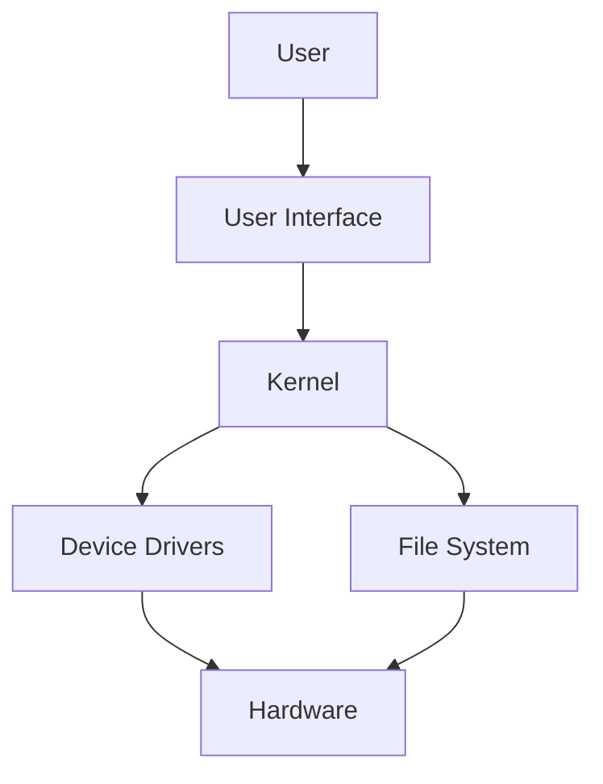

import { Callout, Steps, Step } from "nextra-theme-docs";

# Overview of Operating Systems

An operating system (OS) is a crucial piece of software that manages computer hardware, software resources, and provides common services for computer programs. It acts as an intermediary between the computer's hardware and the user, allowing the user to interact with the computer without needing to know the intricate details of the hardware.

The main functions of an operating system include:

- **Process management**: The OS is responsible for creating, scheduling, and terminating processes, which are instances of programs in execution.
- **Memory management**: The OS manages the allocation and deallocation of memory to programs, ensuring efficient use of available memory resources.
- **File system management**: The OS provides a file system that allows users to store, organize, and retrieve data in a structured manner.
- **Device management**: The OS manages input/output devices, such as keyboards, mice, printers, and disk drives, providing a consistent interface for programs to interact with these devices.
- **User interface**: The OS provides a user interface, which can be either command-line based (CLI) or graphical (GUI), allowing users to interact with the computer.

<Callout type="info">
The two most popular families of operating systems for personal computers are Microsoft Windows and Unix-like systems, such as macOS and Linux distributions.
</Callout>

## Components of an Operating System

An operating system typically consists of several key components:

- **Kernel**: The kernel is the core component of the OS, responsible for managing system resources, such as processes, memory, and input/output devices.
- **Device drivers**: Device drivers are software components that allow the OS to communicate with specific hardware devices, such as printers, disk drives, and network adapters.
- **File system**: The file system is responsible for organizing and managing files and directories on storage devices.
- **User interface**: The user interface can be either command-line based (CLI) or graphical (GUI), providing a way for users to interact with the OS and run applications.

Here's a simple diagram illustrating the relationship between the OS components:

## Types of Operating Systems

Operating systems can be classified based on various criteria, such as:

1. **Single-tasking vs. multi-tasking**: Single-tasking OSes can only run one program at a time, while multi-tasking OSes can run multiple programs concurrently.
2. **Single-user vs. multi-user**: Single-user OSes are designed for one user at a time, while multi-user OSes support multiple users simultaneously.
3. **Distributed vs. centralized**: Distributed OSes manage a group of independent computers and make them appear as a single computer, while centralized OSes run on a single computer.

Some examples of operating systems include:

- **Microsoft Windows**: A family of proprietary OSes developed by Microsoft, primarily for personal computers.
- **macOS**: A proprietary OS developed by Apple for its Macintosh computers.
- **Linux**: A family of open-source, Unix-like OSes based on the Linux kernel, used in a wide range of devices from personal computers to servers and embedded systems.
- **Android**: A mobile OS developed by Google, based on the Linux kernel and designed primarily for touchscreen devices such as smartphones and tablets.
- **iOS**: A mobile OS developed by Apple for its mobile devices, such as iPhones and iPads.

As you dive deeper into operating systems, you'll learn more about their [hardware resources](/hardware-resources), [development cycles and requirements analysis](/development-cycles-and-requirements-analysis), and other crucial aspects that make them an essential part of modern computing.