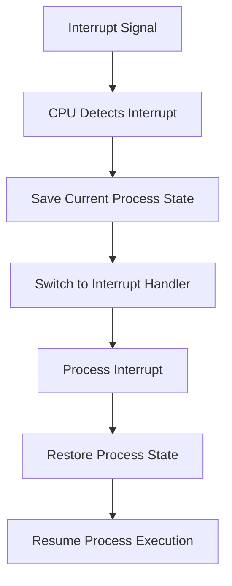

import { Callout, Steps, Step } from "nextra-theme-docs";

# Interrupt Handling

Interrupt handling is a crucial component of modern operating systems, enabling them to effectively manage and respond to various events and requests generated by hardware devices and software processes. When an interrupt occurs, the operating system must efficiently handle the interrupt and ensure that the system remains responsive and stable.

## Overview

Interrupt handling involves several key steps:

<Steps>
### Step 1

The hardware device or software process generates an interrupt signal.

### Step 2

The CPU detects the interrupt signal and saves the current state of the running process.

### Step 3

The CPU switches to the appropriate interrupt handler routine.

### Step 4

The interrupt handler routine processes the interrupt and performs the necessary actions.

### Step 5

The CPU restores the state of the interrupted process and resumes its execution.
</Steps>

To facilitate efficient interrupt handling, operating systems employ various mechanisms and techniques, such as:

- [Interrupt Service Routines (ISRs)](/interrupts-and-interrupt-handling/interrupt-handling/interrupt-service-routines)
- [Interrupt Priority Levels](/interrupts-and-interrupt-handling/interrupt-handling/interrupt-priority-levels)

## Interrupt Handling Process

The interrupt handling process can be visualized using the following flowchart:

<Callout type="info">
The time taken to handle an interrupt is known as the interrupt latency. Minimizing interrupt latency is essential for ensuring system responsiveness and performance.
</Callout>

## Interrupt Handling in Action

Let's consider an example of how interrupt handling works in a real-world scenario. Suppose a user is working on a document in a word processor, and they decide to save the document to a USB drive. Here's what happens behind the scenes:

1. The user clicks the "Save" button, triggering a software interrupt.
2. The CPU detects the interrupt and saves the current state of the word processor process.
3. The CPU switches to the appropriate interrupt handler routine for handling USB drive operations.
4. The interrupt handler routine communicates with the USB drive controller to initiate the save operation.
5. Once the save operation is complete, the interrupt handler routine notifies the CPU.
6. The CPU restores the state of the word processor process and resumes its execution.

Throughout this process, the operating system ensures that the user's work is saved safely to the USB drive without disrupting the overall system's performance.

## Conclusion

Interrupt handling is a critical aspect of operating system design, enabling the system to respond to events and requests in a timely and efficient manner. By employing various techniques and mechanisms, such as interrupt service routines and priority levels, operating systems can effectively manage interrupts and ensure system stability and responsiveness.

For more information on specific interrupt handling techniques, explore the following subsections:

- [Interrupt Service Routines](/interrupts-and-interrupt-handling/interrupt-handling/interrupt-service-routines)
- [Interrupt Priority Levels](/interrupts-and-interrupt-handling/interrupt-handling/interrupt-priority-levels)