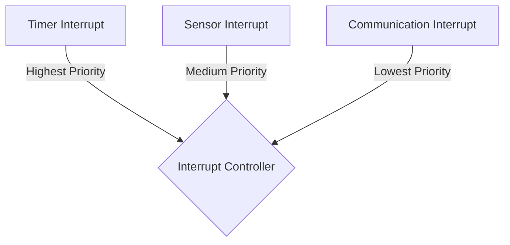

import { Callout, Steps, Step } from "nextra-theme-docs";

# Interrupt Priority Levels

In operating systems, interrupt priority levels are used to manage and prioritize the handling of interrupts based on their importance or urgency. By assigning different priority levels to interrupts, the system can ensure that critical interrupts are handled promptly, while less important interrupts may be delayed or preempted by higher-priority interrupts.

## Assigning Priority Levels

Interrupt priority levels are typically assigned based on the following factors:

1. **Criticality**: Interrupts related to critical system functions, such as memory errors or hardware failures, are assigned higher priority levels to ensure immediate attention.

2. **Timing Requirements**: Interrupts with strict timing requirements, such as real-time events or time-sensitive I/O operations, are given higher priority to meet their deadlines.

3. **Frequency**: Frequently occurring interrupts, such as timer interrupts or network packet arrivals, may be assigned lower priority levels to prevent them from monopolizing the system.

<Callout type="info">
The specific assignment of priority levels may vary depending on the operating system and the underlying hardware architecture.
</Callout>

## Interrupt Nesting

Interrupt priority levels enable a feature called interrupt nesting, which allows higher-priority interrupts to preempt the handling of lower-priority interrupts. When an interrupt occurs during the execution of an interrupt service routine (ISR), the system compares the priority level of the new interrupt with the currently executing ISR.

<Steps>
### Step 1

If the new interrupt has a higher priority level than the current ISR, the system suspends the execution of the current ISR and starts handling the higher-priority interrupt.

### Step 2

Once the higher-priority interrupt is serviced, the system resumes the execution of the preempted ISR from where it left off.
</Steps>

This nesting behavior ensures that critical interrupts are handled promptly, even if the system is already processing a lower-priority interrupt.

## Priority Inversion

Priority inversion is a situation that can occur when a high-priority task is indirectly preempted by a lower-priority task. This happens when the high-priority task is waiting for a resource that is currently held by a lower-priority task, and a medium-priority task preempts the lower-priority task, preventing it from releasing the resource.

To mitigate priority inversion, operating systems employ techniques such as:

- **Priority Inheritance**: The lower-priority task temporarily inherits the priority of the highest-priority task waiting for the resource it holds.

- **Priority Ceiling**: Each resource is assigned a priority ceiling, which is the highest priority of any task that may lock the resource. When a task locks a resource, its priority is temporarily raised to the priority ceiling of the resource.

These techniques help ensure that high-priority tasks are not unduly blocked by lower-priority tasks, maintaining the desired priority order.

## Example

Consider an embedded system with three interrupt sources: a timer, a sensor, and a communication module. The timer interrupt is crucial for maintaining real-time behavior, so it is assigned the highest priority level. The sensor interrupt is less critical but still important for data acquisition, so it is given a medium priority level. The communication module interrupt is assigned the lowest priority level since it is not as time-sensitive.

In this scenario, if the timer interrupt occurs while the sensor interrupt is being handled, the system will preempt the sensor ISR and immediately start processing the timer interrupt. Once the timer interrupt is serviced, the system will resume the sensor ISR. The communication interrupt will only be handled when no higher-priority interrupts are pending.

By properly assigning interrupt priority levels and utilizing interrupt nesting, the system ensures that critical interrupts are serviced promptly, maintaining the desired system behavior and responsiveness.

To learn more about interrupt handling and related concepts, you can explore the following sections:

- [Interrupts](/interrupts-and-interrupt-handling/interrupts)
- [Interrupt Service Routines](/interrupts-and-interrupt-handling/interrupt-handling/interrupt-service-routines)
- [Interrupt Controllers](/interrupts-and-interrupt-handling/interrupt-controllers)