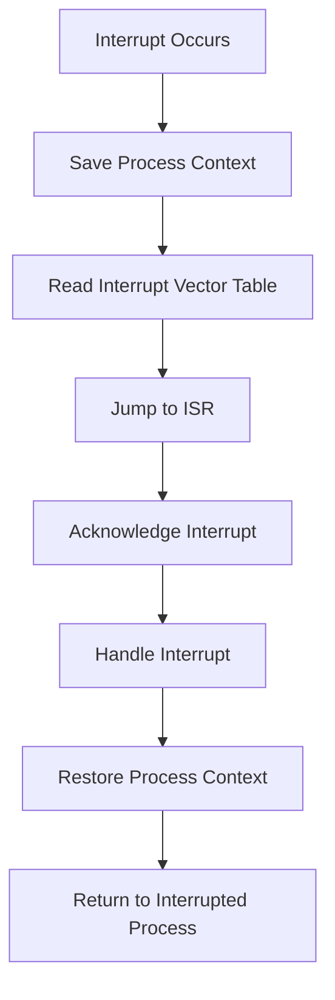

import { Callout, Steps, Step } from "nextra-theme-docs";

# Interrupt Service Routines

Interrupt Service Routines (ISRs) are a crucial component of interrupt handling in operating systems. When an interrupt occurs, the CPU temporarily suspends the execution of the current process and jumps to a specific memory address associated with the interrupt. This memory address contains the starting point of the corresponding ISR.

## What is an Interrupt Service Routine?

An Interrupt Service Routine, also known as an interrupt handler, is a piece of software that is executed in response to a specific interrupt. ISRs are typically written in low-level programming languages, such as assembly or C, to ensure fast execution and minimal overhead.

The primary purpose of an ISR is to:
- Acknowledge the interrupt and clear the interrupt flag
- Save the context of the interrupted process
- Perform the necessary actions to handle the interrupt
- Restore the context of the interrupted process
- Return control to the interrupted process

<Callout type="info">
ISRs are usually short and efficient to minimize the time spent handling interrupts and to ensure prompt response to other pending interrupts.
</Callout>

## Interrupt Service Routine Execution

When an interrupt occurs, the CPU performs the following steps:

<Steps>
### Step 1

The CPU finishes executing the current instruction and saves the program counter (PC) and other relevant registers on the stack.

### Step 2

The CPU reads the interrupt vector table to determine the memory address of the ISR associated with the interrupt.

### Step 3

The CPU jumps to the memory address of the ISR and starts executing the interrupt handler.

### Step 4

The ISR acknowledges the interrupt, saves the context of the interrupted process, and performs the necessary actions to handle the interrupt.

### Step 5

Once the interrupt handling is complete, the ISR restores the context of the interrupted process and returns control to the interrupted process by loading the saved PC and registers from the stack.
</Steps>

The execution flow of an interrupt service routine can be represented using a flowchart:

## Example: Timer Interrupt

One common example of an interrupt is the timer interrupt. Most operating systems use a programmable interval timer (PIT) to generate periodic interrupts. These interrupts are used to perform various tasks, such as:
- Updating system time
- Triggering process scheduling
- Handling time-dependent events

The timer interrupt service routine typically performs the following actions:
1. Acknowledge the timer interrupt
2. Update the system time
3. Check if process scheduling is required
4. If scheduling is required, save the context of the current process and call the scheduler
5. Restore the context of the next process to be executed
6. Return control to the next process

## Interrupt Latency and Response Time

Interrupt latency is the time between the occurrence of an interrupt and the start of the execution of the corresponding ISR. Interrupt response time, on the other hand, is the time between the occurrence of an interrupt and the completion of the ISR.

Minimizing interrupt latency and response time is crucial for real-time systems and applications that require prompt responses to events. Factors that can affect interrupt latency and response time include:
- Interrupt priority levels
- CPU architecture and performance
- ISR complexity and execution time
- Other pending interrupts and their priorities

To optimize interrupt latency and response time, operating systems often employ techniques such as:
- Assigning appropriate interrupt priority levels
- Using hardware interrupt controllers with multiple priority levels
- Minimizing the complexity and execution time of ISRs
- Implementing interrupt nesting and preemption

## Conclusion

Interrupt Service Routines are essential for handling interrupts in operating systems. They provide a mechanism to respond to hardware and software events promptly and efficiently. By understanding the concepts of ISRs, their execution flow, and factors affecting interrupt latency and response time, developers can design and optimize interrupt handling in operating systems to ensure reliable and responsive system behavior.

For more information on related topics, see:
- [Interrupts](/interrupts-and-interrupt-handling/interrupts)
- [Interrupt Priority Levels](/interrupts-and-interrupt-handling/interrupt-handling/interrupt-priority-levels)