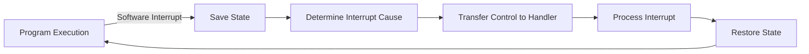

import { Callout, Steps, Step } from "nextra-theme-docs";

# Software Interrupts

Software interrupts, also known as **exceptions**, are interrupts generated by the CPU itself when it encounters certain conditions or executes specific instructions. Unlike hardware interrupts, which are triggered by external devices, software interrupts originate from within the CPU.

## Types of Software Interrupts

There are several types of software interrupts, including:

- **Traps**: Traps are intentional exceptions that are triggered by specific instructions, such as system calls or breakpoints. They allow the operating system to provide services to user-level programs.

- **Faults**: Faults are exceptions that occur due to error conditions, such as division by zero, invalid memory access, or page faults. The operating system can handle these faults and potentially recover from them.

- **Aborts**: Aborts are severe exceptions that indicate a critical error condition, such as hardware failure or a corrupted system state. Aborts typically require the termination of the running process or a system restart.

<Callout type="info">
Software interrupts play a crucial role in the interaction between user-level programs and the operating system. They provide a mechanism for programs to request services from the kernel and handle exceptional conditions.
</Callout>

## Handling Software Interrupts

When a software interrupt occurs, the CPU performs the following steps:

<Steps>
### Step 1

The CPU saves the current state of the executing program, including the program counter and register values, onto the stack.

### Step 2

The CPU determines the cause of the interrupt by examining the interrupt vector table or the exception type.

### Step 3

The CPU transfers control to the corresponding interrupt handler or exception handler routine in the operating system kernel.

### Step 4

The interrupt handler processes the interrupt, performs the necessary actions, and prepares to return control to the interrupted program or to another program.

### Step 5

The CPU restores the saved state from the stack and resumes execution of the interrupted program or the next scheduled program.
</Steps>



## Example: System Calls

System calls are a common example of software interrupts. When a user-level program needs to request a service from the operating system, it invokes a system call. The system call is implemented as a software interrupt, which transfers control to the kernel.

For instance, consider the `read` system call in Linux:

```c
ssize_t read(int fd, void *buf, size_t count);
```

When a program invokes the `read` system call, it triggers a software interrupt. The CPU saves the current state, transfers control to the kernel's system call handler, which processes the `read` request, and then returns control back to the program.

The system call mechanism allows user-level programs to access kernel-level services in a controlled and secure manner.

## Conclusion

Software interrupts are an essential mechanism in operating systems for handling exceptions, traps, and system calls. They enable user-level programs to interact with the kernel and request services. Understanding software interrupts is crucial for developing reliable and efficient software that integrates with the operating system.

For more information on interrupts and interrupt handling, refer to the following sections:

- [Interrupts](/interrupts-and-interrupt-handling/interrupts)
- [Interrupt Handling](/interrupts-and-interrupt-handling/interrupt-handling)