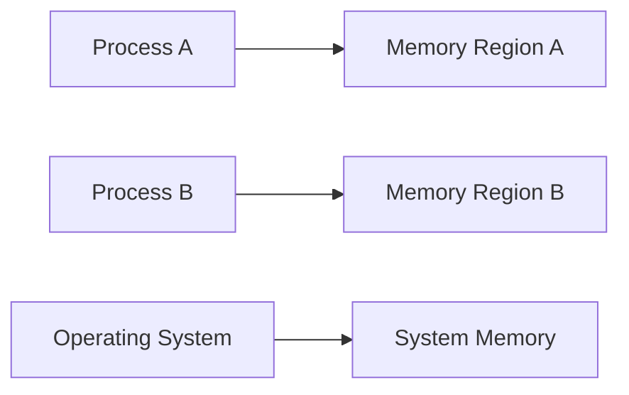

import { Callout, Steps, Step } from "nextra-theme-docs";

# Memory Protection

Memory protection is a crucial aspect of operating systems that ensures the integrity and security of processes running on a system. It prevents unauthorized access to memory regions, safeguarding against malicious or erroneous programs that could potentially corrupt or steal sensitive data.

In a multi-programming environment, where multiple processes run concurrently, memory protection becomes even more critical. Each process should have its own isolated memory space, and the operating system must enforce strict boundaries to prevent processes from interfering with each other's memory.

## Why is Memory Protection Important?

Memory protection serves several key purposes in an operating system:

1. **Process Isolation**: It ensures that each process operates within its own memory space, preventing unauthorized access to other processes' memory.

2. **System Stability**: By preventing processes from modifying critical system memory areas, memory protection helps maintain system stability and prevents crashes.

3. **Security**: Memory protection mechanisms help mitigate security vulnerabilities, such as buffer overflow attacks, by enforcing strict boundaries and access controls.

4. **Error Detection**: Attempts to access restricted memory regions can be detected and handled gracefully, preventing unintended consequences.

## Memory Protection Mechanisms

Operating systems employ various mechanisms to enforce memory protection. Two fundamental approaches are:

1. [Access Rights](/memory-protection-and-page-tables/memory-protection/access-rights): This mechanism assigns specific access rights (read, write, execute) to memory regions, defining which processes can perform certain operations on those regions.

2. [Segmentation](/memory-protection-and-page-tables/memory-protection/segmentation): This technique divides memory into segments, each with its own access rights and permissions. Processes are only allowed to access segments for which they have the necessary privileges.

These mechanisms work in conjunction with hardware support, such as memory management units (MMUs) and translation lookaside buffers (TLBs), to efficiently enforce memory protection at runtime.

<Callout type="info">
Memory protection is closely tied to the concept of virtual memory, which provides each process with its own isolated memory space. The operating system maps virtual addresses to physical memory addresses, allowing for efficient and secure memory management.
</Callout>

## Example: Process Isolation

Consider a scenario where two processes, Process A and Process B, are running on a system. Memory protection ensures that:

- Process A cannot read or modify Process B's memory, and vice versa.
- Processes cannot access system-reserved memory regions without appropriate privileges.
- If a process attempts an unauthorized memory access, the operating system can detect and handle the violation, preventing potential security breaches or system instability.

By enforcing strict memory protection, the operating system maintains the integrity and isolation of each process's memory space.

## Conclusion

Memory protection is a fundamental concept in operating systems that ensures process isolation, system stability, and security. Through mechanisms like access rights and segmentation, operating systems can effectively control and restrict memory access, preventing unauthorized operations and maintaining the overall integrity of the system.