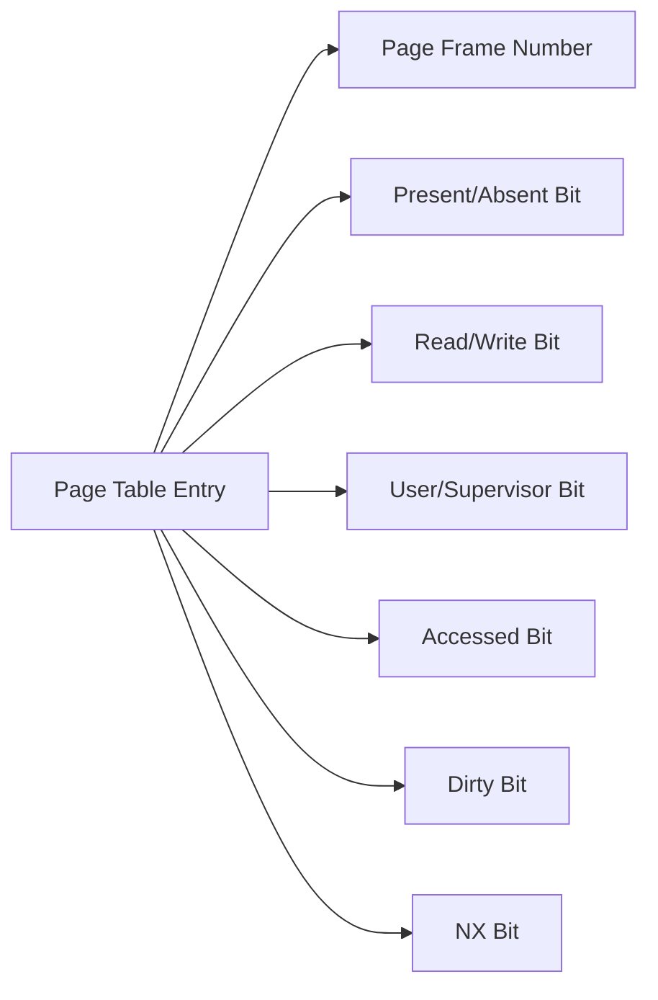

import { Callout, Steps, Step } from "nextra-theme-docs";

# Access Rights

Access rights, also known as permissions, are a fundamental concept in memory protection. They determine the level of access that a process or user has to a specific memory region. Operating systems use access rights to enforce security and prevent unauthorized access to sensitive data.

## Types of Access Rights

Operating systems typically support three main types of access rights:

1. **Read (R)**: Allows a process to read the contents of a memory region.
2. **Write (W)**: Allows a process to modify the contents of a memory region.
3. **Execute (X)**: Allows a process to execute the instructions stored in a memory region.

These access rights can be combined to create different levels of permissions. For example:

- **Read-only (R)**: The process can only read the memory region but cannot modify or execute it.
- **Read-write (RW)**: The process can read and write to the memory region but cannot execute it.
- **Read-execute (RX)**: The process can read and execute the instructions in the memory region but cannot modify it.
- **Read-write-execute (RWX)**: The process has full access to the memory region and can read, write, and execute its contents.

<Callout type="warning">
Granting execute permissions to writable memory regions can be dangerous, as it may allow attackers to inject and execute malicious code. It is generally recommended to keep execute permissions separate from write permissions.
</Callout>

## Granularity of Access Rights

Access rights can be applied at different levels of granularity, depending on the memory management scheme used by the operating system:

1. **Page-level protection**: In paging systems, access rights are associated with each page table entry. The operating system sets the appropriate access rights for each page, and the MMU enforces these permissions during memory accesses.

2. **Segment-level protection**: In segmentation systems, access rights are associated with each segment. The operating system assigns access rights to each segment, and the hardware enforces these permissions when a process attempts to access memory within a segment.

## Implementing Access Rights

To implement access rights, the operating system typically uses a combination of hardware and software mechanisms:

1. **Hardware support**: Modern processors provide hardware features, such as the NX (No-Execute) bit or the XD (Execute Disable) bit, to support access rights. These bits allow the operating system to mark specific pages as non-executable, preventing code injection attacks.

2. **Page table entries**: In paging systems, the page table entries contain additional bits to store the access rights for each page. The operating system sets these bits when mapping pages to physical memory, and the MMU checks these bits during memory accesses to enforce the permissions.

Here's an example of how access rights can be stored in a page table entry:



In this example, the page table entry contains several bits that control the access rights and other attributes of the page:

- **Present/Absent Bit**: Indicates whether the page is currently in physical memory or not.
- **Read/Write Bit**: Determines if the page is read-only or writable.
- **User/Supervisor Bit**: Specifies whether the page can be accessed by user-mode processes or only by the kernel.
- **Accessed Bit**: Set by the MMU when the page is accessed, useful for page replacement algorithms.
- **Dirty Bit**: Set by the MMU when the page is modified, indicating that it needs to be written back to disk.
- **NX Bit**: Marks the page as non-executable, preventing code execution from that page.

The operating system sets these bits when mapping pages to physical memory, and the MMU enforces the access rights during memory accesses. If a process attempts to access a page in a way that violates the access rights, the MMU generates a page fault, and the operating system handles the exception accordingly.

## Example: Linux Access Rights

In Linux, access rights are managed through the page table entries and the `mprotect()` system call. The `mprotect()` system call allows processes to change the access rights of a memory region at runtime.

Here's an example of how to use `mprotect()` in C:

```c
#include <sys/mman.h>

void* memory = malloc(4096);

// Set the memory region to read-only
mprotect(memory, 4096, PROT_READ);

// Set the memory region to read-write
mprotect(memory, 4096, PROT_READ | PROT_WRITE);

// Set the memory region to read-execute
mprotect(memory, 4096, PROT_READ | PROT_EXEC);
```

In this example, `mprotect()` is used to change the access rights of a memory region allocated with `malloc()`. The `PROT_READ`, `PROT_WRITE`, and `PROT_EXEC` constants are used to specify the desired access rights.

<Steps>

### Step 1
Allocate a memory region using `malloc()` or other memory allocation functions.

### Step 2
Use `mprotect()` to set the desired access rights for the memory region. Pass the starting address of the memory region, its size, and the desired protection flags (`PROT_READ`, `PROT_WRITE`, `PROT_EXEC`) to the `mprotect()` system call.

### Step 3
Access the memory region according to the set access rights. If you attempt to access the memory region in a way that violates the access rights, a segmentation fault will occur.

</Steps>

By using `mprotect()`, processes can dynamically change the access rights of memory regions, enabling features like runtime code generation, just-in-time compilation, and self-modifying code.

For more information on memory protection and segmentation, you can refer to the [Segmentation](/memory-protection-and-page-tables/memory-protection/segmentation) section.