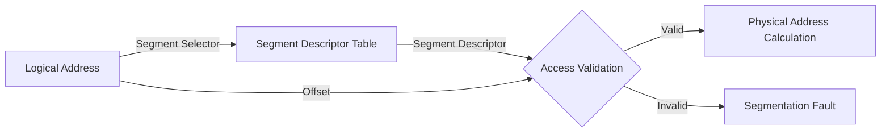

import { Callout, Steps, Step } from "nextra-theme-docs";

# Segmentation

Segmentation is a memory protection technique used in operating systems to divide the computer's memory into segments and enforce access control permissions on each segment. It provides a way to isolate and protect different parts of a program's memory space from unauthorized access by other programs or processes.

## How Segmentation Works

In a segmented memory system, the logical address space of a process is divided into segments, each representing a logical unit of the program, such as code, data, or stack. Each segment has its own base address and limit, defining the starting point and the size of the segment in memory.

When a process accesses memory using a logical address, the CPU performs a segmentation check to ensure that the address falls within the boundaries of a valid segment. The logical address consists of two parts:

- Segment selector: Identifies the segment being accessed
- Offset: Specifies the location within the segment

The segment selector is used to look up the segment descriptor, which contains information about the segment, including its base address and limit. The offset is then added to the base address to obtain the physical address in memory.

<Steps>

### Step 1: Logical Address Generation
The program generates a logical address consisting of a segment selector and an offset.

### Step 2: Segment Descriptor Lookup
The segment selector is used to look up the corresponding segment descriptor in the segment descriptor table.

### Step 3: Access Validation
The offset is compared against the segment limit to ensure it falls within the valid range of the segment.

### Step 4: Physical Address Calculation
If the offset is valid, it is added to the segment's base address to obtain the physical address in memory.

</Steps>

Here's a visual representation of the segmentation process:

## Advantages of Segmentation

Segmentation offers several advantages in terms of memory protection and program organization:

- **Logical Organization**: Segmentation allows programs to be divided into logical units, making it easier to manage and organize code and data.
- **Access Control**: Each segment can have its own access permissions (read, write, execute), enforcing strict control over which parts of the program can access specific segments.
- **Sharing and Protection**: Segments can be shared among processes or protected from unauthorized access, enhancing both resource utilization and security.
- **Dynamic Memory Allocation**: Segments can be allocated and deallocated dynamically, providing flexibility in memory management.

## Disadvantages of Segmentation

While segmentation provides memory protection and logical organization, it also has some drawbacks:

- **External Fragmentation**: As segments are allocated and deallocated, holes of unused memory can appear between segments, leading to external fragmentation and reduced memory utilization.
- **Complexity**: Managing segments and their descriptors adds complexity to the operating system and requires additional overhead for segment table management and access validation.
- **Limited Flexibility**: Segmentation may not be as flexible as other memory protection schemes, such as paging, in terms of granularity and efficient memory utilization.

## Segmentation vs. Paging

Segmentation and paging are two different memory management and protection techniques used in operating systems. While segmentation focuses on dividing memory into logical segments, paging divides memory into fixed-size pages. Paging is more commonly used in modern operating systems due to its simplicity and efficiency in managing memory. However, some systems may use a combination of segmentation and paging to achieve a balance between logical organization and efficient memory utilization.

To learn more about paging, see the [Paging](/memory-resources-and-paging/paging) section.

## Conclusion

Segmentation is a memory protection technique that divides memory into logical segments and enforces access control permissions on each segment. It provides a way to organize and protect different parts of a program's memory space. While segmentation offers advantages such as logical organization and access control, it also has limitations, such as external fragmentation and complexity. Understanding segmentation is important for appreciating the evolution of memory protection mechanisms in operating systems.