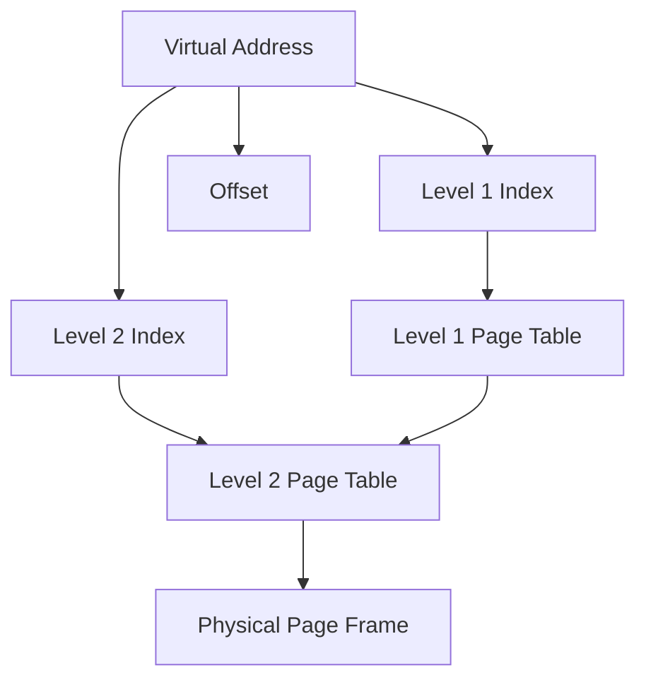

import { Callout, Steps, Step } from "nextra-theme-docs";

# Page Table Structure

In operating systems, page tables play a crucial role in memory management by providing a mapping between virtual addresses used by processes and physical addresses in main memory. The structure of a page table is designed to efficiently translate virtual addresses to physical addresses and support various memory protection mechanisms.

## Page Table Entries

The basic unit of a page table is a page table entry (PTE). Each PTE contains information about a specific page in the virtual address space of a process. A typical PTE includes the following fields:

- **Page Frame Number (PFN)**: The physical page frame number that corresponds to the virtual page.
- **Present/Valid Bit**: Indicates whether the page is currently in main memory or swapped out to disk.
- **Protection Bits**: Specify the access permissions for the page, such as read, write, or execute.
- **Dirty Bit**: Indicates whether the page has been modified since it was last loaded into memory.
- **Accessed Bit**: Indicates whether the page has been accessed recently.

<Callout type="info">
The exact structure and fields of a PTE may vary depending on the specific operating system and hardware architecture.
</Callout>

## Multi-Level Page Tables

To handle large virtual address spaces efficiently, modern operating systems often employ multi-level page tables. In a multi-level page table structure, the virtual address is divided into multiple parts, each serving as an index into a different level of the page table.

The translation process works as follows:

<Steps>
### Step 1

The virtual address is divided into multiple parts, each serving as an index into a different level of the page table.

### Step 2

The top-level index is used to locate the appropriate entry in the first-level page table.

### Step 3

The entry in the first-level page table points to the second-level page table.

### Step 4

The next-level index is used to locate the appropriate entry in the second-level page table.

### Step 5

The process continues until the last-level page table is reached, which contains the physical page frame number.

### Step 6

The offset from the virtual address is added to the physical page frame number to obtain the final physical address.
</Steps>

Multi-level page tables reduce memory overhead by allowing unused portions of the virtual address space to be left unmapped. Only the necessary page tables are allocated, resulting in efficient memory utilization.

## Page Table Optimizations

To improve the performance of address translation and reduce memory overhead, several optimizations are commonly used in page table structures:

- **Translation Lookaside Buffer (TLB)**: A hardware cache that stores recently used page table entries to avoid accessing the page table in memory for every address translation. You can learn more about TLBs in the [Translation Lookaside Buffer](/memory-protection-and-page-tables/page-tables/translation-lookaside-buffer) section.

- **Huge Pages**: Operating systems can support larger page sizes, known as huge pages or superpages, to reduce the number of page table entries and improve TLB coverage. This optimization is particularly useful for applications with large memory footprints.

- **Inverted Page Tables**: Instead of maintaining a page table for each process, an inverted page table maintains a single table that maps physical page frames to virtual pages. This approach reduces memory overhead but may increase the complexity of address translation.

<Callout type="warning">
Page table optimizations are highly dependent on the specific hardware architecture and operating system implementation. The effectiveness of these optimizations may vary based on the workload and system configuration.
</Callout>

By understanding the structure and optimizations of page tables, operating system developers can design efficient and secure memory management mechanisms that cater to the needs of modern computing systems.