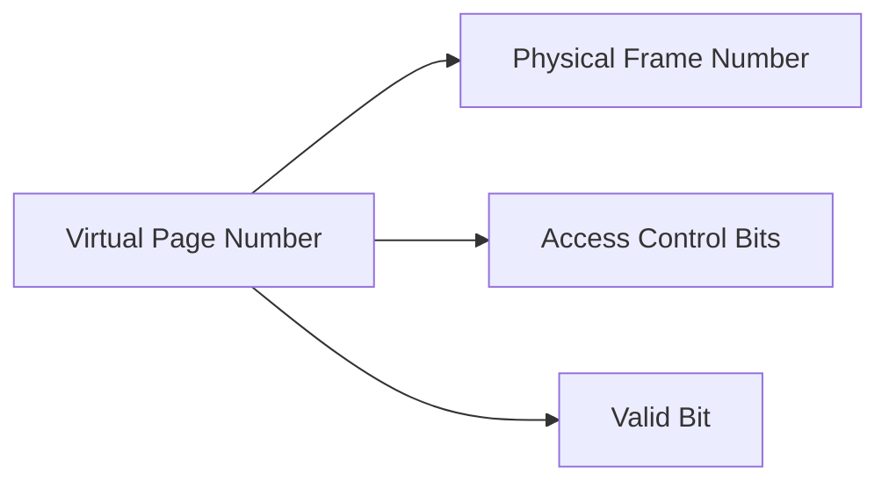

import { Callout, Steps, Step } from "nextra-theme-docs";

# Translation Lookaside Buffer (TLB)

The Translation Lookaside Buffer (TLB) is a small, fast cache memory that is used to improve the speed of virtual to physical address translation. It stores recently used page table entries, allowing the Memory Management Unit (MMU) to quickly translate virtual addresses to physical addresses without having to access the main memory.

## Why is TLB needed?

In a paging system, every memory access requires the MMU to translate the virtual address to a physical address. This translation involves accessing the page table, which is stored in main memory. Accessing main memory for every address translation would significantly slow down the system's performance.

To overcome this issue, the TLB is introduced as a cache for page table entries. When a virtual address needs to be translated, the MMU first checks the TLB for the corresponding page table entry. If the entry is found (a TLB hit), the physical address can be quickly retrieved without accessing the main memory. If the entry is not found (a TLB miss), the MMU must access the page table in main memory to fetch the entry and store it in the TLB for future use.

<Callout type="info">
The TLB is a critical component in modern computer systems, as it significantly reduces the overhead of address translation and improves overall system performance.
</Callout>

## TLB Structure

The TLB is typically implemented as a fully associative or set-associative cache. Each entry in the TLB contains the following information:

- Virtual page number (VPN)
- Physical frame number (PFN)
- Access control bits (e.g., read, write, execute)
- Valid bit

The VPN is used as a tag to identify the page table entry in the TLB. The PFN is the corresponding physical frame number that the virtual page is mapped to. Access control bits determine the permissions for accessing the page, and the valid bit indicates whether the entry is valid or not.

Here's an example of a TLB entry:

## TLB Operation

The TLB operates in the following manner:

<Steps>
### Step 1

The CPU generates a virtual address and sends it to the MMU.

### Step 2

The MMU extracts the virtual page number (VPN) from the virtual address and checks the TLB for a matching entry.

### Step 3

If a matching entry is found (TLB hit), the MMU retrieves the corresponding physical frame number (PFN) and access control bits from the TLB entry. The PFN is combined with the offset from the virtual address to form the physical address.

### Step 4

If no matching entry is found (TLB miss), the MMU accesses the page table in main memory to fetch the corresponding page table entry. The entry is then stored in the TLB for future use.
</Steps>

The TLB hit rate, which is the percentage of virtual addresses that are successfully translated using the TLB, is a crucial factor in determining the system's performance. A higher hit rate means fewer accesses to the main memory and faster address translation.

## TLB Management

The operating system is responsible for managing the TLB and ensuring its consistency with the page table. When the operating system makes changes to the page table (e.g., during [page replacement](/memory-resources-and-paging/paging)), it must also update or invalidate the corresponding entries in the TLB. Some common TLB management techniques include:

- TLB flushing: Invalidating all entries in the TLB when a context switch occurs or when the page table is modified.
- TLB shootdown: Invalidating specific TLB entries on multiple processors in a multiprocessor system when a page table entry is modified.

## Conclusion

The Translation Lookaside Buffer (TLB) is a crucial component in modern computer systems that significantly improves the performance of virtual to physical address translation. By caching recently used page table entries, the TLB reduces the overhead of accessing the main memory for every address translation. Effective management of the TLB by the operating system is essential for maintaining system performance and consistency.