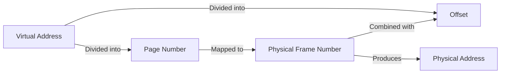

import { Callout, Steps, Step } from "nextra-theme-docs";

# Virtual Memory

Virtual memory is a memory management technique used by operating systems to provide a large, contiguous address space to processes, regardless of the actual physical memory available. It abstracts the physical memory layout and allows processes to access memory as if they have a dedicated, continuous memory space.

## How Virtual Memory Works

Virtual memory works by mapping virtual addresses used by processes to physical addresses in the main memory (RAM). The operating system maintains a page table that keeps track of these mappings. When a process tries to access a virtual address, the operating system translates it to the corresponding physical address using the page table.

<Callout type="info">
Virtual memory enables processes to have a larger address space than the physical memory available in the system.
</Callout>

The virtual address space is divided into fixed-size units called pages, and the physical memory is divided into frames of the same size. The page table maps virtual pages to physical frames. If a requested page is not found in the physical memory (a page fault occurs), the operating system retrieves the page from the secondary storage (e.g., hard disk) and loads it into a physical frame.

## Benefits of Virtual Memory

Virtual memory offers several benefits:

- **Increased Multiprogramming**: Virtual memory allows more processes to be loaded into memory simultaneously, as each process has its own virtual address space.
- **Efficient Memory Utilization**: Processes can allocate memory as needed, and the operating system can efficiently manage the physical memory by swapping unused pages to secondary storage.
- **Isolation and Protection**: Each process has its own virtual address space, providing isolation and protection from other processes.
- **Simplified Memory Management**: Developers can write programs without worrying about the physical memory layout or the presence of other processes.

## Page Table and Address Translation

The page table is a critical component of virtual memory management. It contains entries that map virtual pages to physical frames. When a process accesses a virtual address, the operating system performs the following steps to translate it to a physical address:

<Steps>
### Step 1: Extract Page Number and Offset

The virtual address is divided into two parts: the page number and the offset within the page.

### Step 2: Consult Page Table

The operating system looks up the page table entry corresponding to the virtual page number.

### Step 3: Obtain Physical Frame Number

If the page is present in the physical memory, the page table entry contains the corresponding physical frame number.

### Step 4: Combine Frame Number and Offset

The physical address is obtained by combining the physical frame number and the offset within the page.
</Steps>

The address translation process can be represented using the following diagram:

## Page Faults and Swapping

When a process tries to access a virtual page that is not currently loaded in physical memory, a page fault occurs. The operating system handles the page fault by performing the following steps:

1. **Locate the Page**: The operating system looks up the location of the requested page on the secondary storage.
2. **Find a Free Frame**: It finds a free physical frame to accommodate the page. If no free frames are available, it may need to replace an existing page using a page replacement algorithm.
3. **Load the Page**: The requested page is loaded from the secondary storage into the allocated physical frame.
4. **Update Page Table**: The page table entry is updated to map the virtual page to the newly allocated physical frame.
5. **Resume Execution**: The process resumes execution from the instruction that caused the page fault.

Page faults introduce overhead, as accessing secondary storage is much slower than accessing physical memory. However, virtual memory systems aim to minimize page faults by employing efficient page replacement algorithms and optimizing memory usage.

<Callout type="info">
To learn more about page replacement algorithms, see the [Page Replacement](/object-oriented-implementations-and-page-replacement/page-replacement) section.
</Callout>

## Thrashing

Thrashing is a situation that occurs when a system spends more time swapping pages in and out of memory than executing useful work. It happens when the working set of a process (the set of pages frequently accessed) is larger than the available physical memory. As a result, the system constantly pages out and brings in pages, leading to high page fault rates and reduced system performance.

To mitigate thrashing, operating systems employ techniques such as:

- **Increasing Physical Memory**: Adding more physical memory to the system can accommodate larger working sets and reduce thrashing.
- **Adjusting Memory Allocation**: Operating systems can dynamically adjust the memory allocated to processes based on their memory access patterns and priority.
- **Swapping Out Entire Processes**: Instead of swapping individual pages, the operating system may swap out entire processes that are not actively using the CPU, freeing up memory for other processes.

## Conclusion

Virtual memory is a powerful technique used by operating systems to provide processes with a large, contiguous address space, regardless of the actual physical memory available. It abstracts the physical memory layout, enables efficient memory utilization, and provides isolation and protection between processes.

By employing page tables, address translation, and swapping mechanisms, virtual memory allows multiple processes to coexist in memory and access memory beyond the physical limits of the system. However, it is important to manage virtual memory effectively to avoid performance issues such as thrashing.

Understanding virtual memory concepts is crucial for operating system designers, system administrators, and developers working on memory-intensive applications.