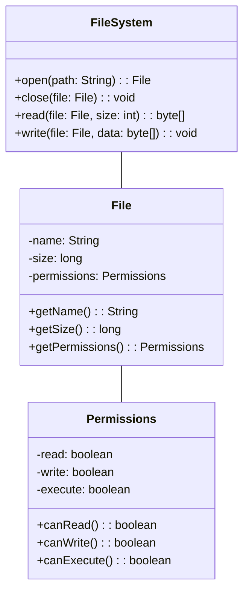

import { Callout, Steps, Step } from "nextra-theme-docs";

# Object-Oriented Implementations

Object-oriented programming (OOP) has become a dominant paradigm in software development, and its principles have been widely adopted in the design and implementation of operating systems. OOP provides a modular and organized approach to building complex systems, making them easier to understand, maintain, and extend.

In the context of operating systems, object-oriented implementations offer several advantages:

- **Modularity**: OOP allows the operating system to be divided into smaller, self-contained modules or classes. Each class encapsulates related data and functions, promoting a clear separation of concerns and reducing dependencies between different parts of the system.

- **Reusability**: By designing classes with well-defined interfaces and behaviors, operating system components can be reused across different parts of the system or even in future projects. This reduces code duplication and promotes code reuse, leading to faster development and more maintainable systems.

- **Extensibility**: OOP enables the creation of hierarchical relationships between classes through inheritance. This allows new classes to be derived from existing ones, inheriting their properties and behaviors while adding or modifying specific functionality. Extensibility is crucial in operating systems, as it facilitates the addition of new features and the adaptation to evolving hardware and software requirements.

<Callout emoji="💡">
Object-oriented implementations in operating systems provide a structured and modular approach to system design, enhancing code reusability, maintainability, and extensibility.
</Callout>

Two fundamental concepts in object-oriented implementations are [encapsulation](/object-oriented-implementations-and-page-replacement/object-oriented-implementations/encapsulation) and [polymorphism](/object-oriented-implementations-and-page-replacement/object-oriented-implementations/polymorphism). Encapsulation ensures data hiding and promotes a clear separation between the internal representation of an object and its external interface. Polymorphism allows objects of different classes to be treated as instances of a common base class, enabling dynamic binding and flexible interactions between objects.

Let's consider an example of how object-oriented principles can be applied in the design of a file system in an operating system:

In this example, the file system is represented by the `FileSystem` class, which provides methods for opening, closing, reading from, and writing to files. The `File` class represents an individual file and encapsulates its properties, such as name, size, and permissions. The `Permissions` class encapsulates the access permissions associated with a file.

By organizing the file system components into classes with well-defined responsibilities and interactions, the object-oriented approach promotes a modular and maintainable design. The classes can be easily extended or modified without affecting the entire system, and new functionality can be added by deriving new classes from the existing ones.

Object-oriented implementations in operating systems provide a powerful and flexible framework for building robust and scalable systems. By leveraging the principles of encapsulation, inheritance, and polymorphism, operating systems can achieve a high degree of modularity, reusability, and extensibility, leading to more efficient and maintainable software systems.