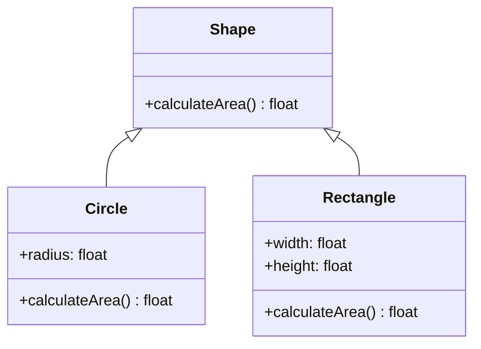

import { Callout, Steps, Step } from "nextra-theme-docs";

# Polymorphism

Polymorphism is a fundamental concept in object-oriented programming that allows objects of different classes to be treated as objects of a common parent class. It enables you to write code that can work with objects of multiple types, providing flexibility and extensibility to your software design.

## Types of Polymorphism

There are two main types of polymorphism in object-oriented programming:

1. **Compile-time Polymorphism (Static Polymorphism):**
   - Also known as method overloading.
   - Occurs when multiple methods with the same name but different parameters are defined in a class.
   - The compiler determines which method to invoke based on the number, types, and order of arguments passed during the method call.

2. **Runtime Polymorphism (Dynamic Polymorphism):**
   - Also known as method overriding.
   - Occurs when a subclass provides a specific implementation of a method that is already defined in its parent class.
   - The method to be invoked is determined at runtime based on the actual object type.

<Callout type="info">
Polymorphism is closely related to inheritance. It allows you to treat objects of derived classes as objects of their base class, enabling code reuse and flexibility.
</Callout>

## Example: Shape Hierarchy

Let's consider an example to illustrate polymorphism. Suppose we have a base class called `Shape` and two derived classes, `Circle` and `Rectangle`, that inherit from `Shape`.



In this example, the `Shape` class defines a virtual method `calculateArea()`, which is overridden by the `Circle` and `Rectangle` classes to provide their specific implementations.

<Steps>
### Step 1: Create objects of derived classes

```java
Shape circle = new Circle(5.0);
Shape rectangle = new Rectangle(4.0, 6.0);
```

### Step 2: Call the polymorphic method

```java
float circleArea = circle.calculateArea();
float rectangleArea = rectangle.calculateArea();
```
</Steps>

When the `calculateArea()` method is called on the `circle` and `rectangle` objects, the appropriate overridden method in the respective derived classes (`Circle` and `Rectangle`) is invoked at runtime. This is an example of runtime polymorphism.

## Benefits of Polymorphism

1. **Code Reusability:** Polymorphism allows you to write generic code that can work with objects of multiple types, reducing code duplication and increasing reusability.

2. **Extensibility:** By using polymorphism, you can extend the behavior of existing classes without modifying their code. You can create new derived classes that override or extend the functionality of the base class.

3. **Flexibility:** Polymorphism enables you to write flexible and adaptable code. You can define methods in the base class that can be overridden by derived classes, allowing them to provide their own implementations.

4. **Modularity:** Polymorphism promotes a modular design by allowing objects of different classes to be treated uniformly through a common interface. This enhances the maintainability and readability of the codebase.

<Callout type="warning">
When using polymorphism, it's important to ensure that the overridden methods in derived classes adhere to the contract defined by the base class. Violating the contract can lead to unexpected behavior.
</Callout>

By leveraging polymorphism, you can create flexible and extensible software systems that are easier to maintain and evolve over time. It is a powerful tool in object-oriented design that allows you to write more modular, reusable, and adaptable code.

For more information on object-oriented design principles, you can refer to the [Object-Oriented Design](/virtual-memory-and-object-oriented-design/object-oriented-design) section.