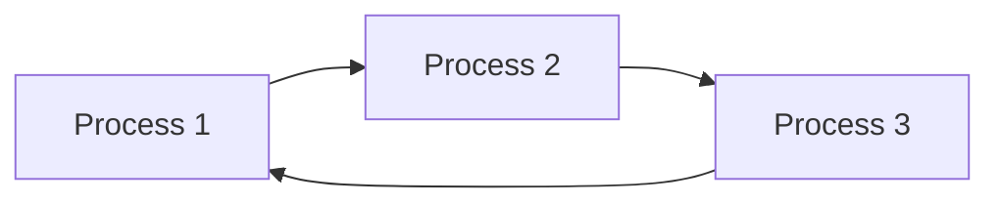

import { Callout, Steps, Step } from "nextra-theme-docs";

# Scheduling Algorithms

Operating systems use scheduling algorithms to determine the order in which processes are executed on the CPU. These algorithms play a crucial role in optimizing system performance, ensuring fairness, and minimizing response times. In this section, we will explore various scheduling algorithms used in process management.

## Types of Scheduling Algorithms

There are several types of scheduling algorithms, each with its own strengths and weaknesses:

- **First-Come, First-Served (FCFS)**: Processes are executed in the order they arrive, without any preemption.
- **Shortest Job Next (SJN)**: The process with the shortest estimated execution time is selected for execution.
- **Priority Scheduling**: Each process is assigned a priority, and the process with the highest priority is executed first.
- **Round Robin (RR)**: Processes are executed in a cyclic manner, each receiving a fixed time slice (quantum) of CPU time.
- **Multilevel Queue Scheduling**: Processes are divided into different queues based on their characteristics, such as priority or resource requirements.

<Callout type="info">
Scheduling algorithms can be classified as either preemptive or non-preemptive. Preemptive algorithms allow the operating system to interrupt a running process and switch to another process, while non-preemptive algorithms wait for a process to voluntarily release the CPU.
</Callout>

## Criteria for Evaluating Scheduling Algorithms

When evaluating scheduling algorithms, several criteria are considered:

- **CPU Utilization**: The percentage of time the CPU is actively executing processes.
- **Throughput**: The number of processes completed per unit of time.
- **Turnaround Time**: The total time taken from the submission of a process to its completion.
- **Waiting Time**: The amount of time a process spends waiting in the ready queue.
- **Response Time**: The time interval between the submission of a request and the first response from the system.

A good scheduling algorithm should aim to maximize CPU utilization and throughput while minimizing turnaround time, waiting time, and response time.

## Example: Round Robin Scheduling

Let's consider an example of the Round Robin (RR) scheduling algorithm. In RR scheduling, each process is assigned a fixed time quantum (e.g., 10 milliseconds) and is executed for that duration before being preempted and moved to the back of the ready queue.

<Steps>

### Step 1: Process Arrival
- Process 1 arrives and starts executing for its time quantum.
- Process 2 arrives and is added to the ready queue.
- Process 3 arrives and is added to the ready queue.

### Step 2: Time Quantum Expiration
- Process 1 completes its time quantum and is preempted.
- Process 2 starts executing for its time quantum.
- Process 1 is added to the back of the ready queue.

### Step 3: Repeat
- Process 2 completes its time quantum and is preempted.
- Process 3 starts executing for its time quantum.
- Process 2 is added to the back of the ready queue.
- The cycle continues until all processes complete their execution.

</Steps>

The RR scheduling algorithm ensures fair allocation of CPU time among processes and provides good response times. However, it may suffer from higher context switching overhead due to frequent process switches.

## Conclusion

Scheduling algorithms are essential components of process management in operating systems. They determine the order and priority of process execution, aiming to optimize system performance and resource utilization. By understanding the different types of scheduling algorithms and their evaluation criteria, developers can make informed decisions when designing and implementing operating systems.

For more information on process management techniques, refer to the [Synchronization](/process-management/process-management-techniques/synchronization) section.