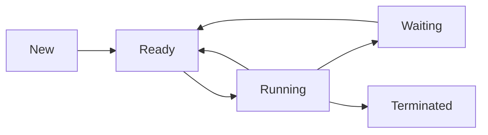

import { Callout, Steps, Step } from "nextra-theme-docs";

# Process Concept

A process is a fundamental concept in operating systems that represents an instance of a program in execution. It is an essential building block for managing system resources and enabling the concurrent execution of multiple tasks. In this section, we will explore the process concept in more detail, discussing its key features and significance in operating system design.

## Definition and Characteristics

A process can be defined as a program in execution, along with its associated resources and state information. It encompasses the following key elements:

1. **Program code**: The executable instructions that define the behavior of the process.
2. **Data**: The variables, data structures, and memory space used by the process during its execution.
3. **Process control block (PCB)**: A data structure maintained by the operating system that contains essential information about the process, such as its state, program counter, CPU registers, memory allocation, and resource descriptors.

<Callout type="info">
The process control block (PCB) acts as a centralized repository for all process-related information, facilitating efficient process management by the operating system.
</Callout>

Processes exhibit several important characteristics that distinguish them from simple programs:

- **Dynamic nature**: Processes are dynamic entities that evolve over time as they execute instructions, modify data, and interact with system resources.
- **Independence**: Each process has its own virtual address space and operates independently of other processes, unless explicitly designed to communicate or share resources.
- **Concurrency**: Multiple processes can execute concurrently on a system, either through true parallelism (on multiprocessor systems) or interleaved execution (on single-processor systems).

## Process States

Throughout its lifetime, a process transitions through various states that reflect its current activity and resource allocation. The typical process states are:

1. **New**: The process is being created and its necessary resources are being allocated.
2. **Ready**: The process is ready to execute and is waiting to be assigned to a CPU.
3. **Running**: The process is currently executing on a CPU.
4. **Waiting** (or Blocked): The process is waiting for a specific event to occur or a resource to become available.
5. **Terminated**: The process has completed its execution or has been forcefully terminated.

The transitions between these states are triggered by events such as process creation, scheduling decisions, resource allocation, I/O operations, and process termination.

## Process Control Block (PCB)

The process control block (PCB) is a crucial data structure used by the operating system to manage processes efficiently. It contains all the information necessary to describe and control a process. The typical contents of a PCB include:

- **Process identification**: Unique identifiers such as process ID (PID) and user ID (UID).
- **Process state**: The current state of the process (e.g., new, ready, running, waiting, terminated).
- **Program counter**: The address of the next instruction to be executed.
- **CPU registers**: The values of CPU registers when the process is not running.
- **Memory management information**: Memory allocation, page tables, and segmentation information.
- **I/O status**: Information about open files, I/O devices, and pending I/O operations.
- **Accounting information**: Resource usage statistics, such as CPU time consumed and system resources allocated.

The PCB acts as an interface between the process and the operating system, enabling efficient process management and context switching.

<Steps>
### Step 1

The operating system creates a new PCB when a process is created.

### Step 2

The PCB is updated throughout the process lifecycle to reflect changes in the process state, resource allocation, and execution progress.

### Step 3

When a context switch occurs, the operating system saves the current process's state in its PCB and loads the state of the next process to be executed from its respective PCB.
</Steps>

By maintaining a PCB for each process, the operating system can effectively manage multiple processes, allocate resources, and ensure fair and efficient execution of tasks.

## Process Creation and Termination

Processes are dynamically created and terminated in an operating system. The creation of a new process involves the following steps:

1. **Allocation of a unique process identifier (PID)**.
2. **Allocation of necessary resources**, such as memory and I/O devices.
3. **Initialization of the process control block (PCB)** with initial values.
4. **Insertion of the process into the ready queue** to await execution.

Process termination, on the other hand, occurs when a process completes its execution, encounters an error, or is forcefully terminated by the operating system or another process. Upon termination, the operating system performs the following tasks:

1. **Releases the resources** allocated to the process.
2. **Removes the process's PCB** from the system.
3. **Updates the process's parent or child processes**, if any, to reflect the termination.

The operating system must carefully manage process creation and termination to ensure the stability, security, and efficiency of the system.

## Process Hierarchy and Relationships

Processes in an operating system can have hierarchical relationships, forming a process tree or process hierarchy. The process that creates another process is called the parent process, while the newly created process is referred to as the child process. This parent-child relationship has several implications:

- **Resource sharing**: Child processes may inherit certain resources, such as open files or environment variables, from their parent process.
- **Process control**: Parent processes have some level of control over their child processes, such as the ability to wait for their termination or send signals to them.
- **Process termination**: When a parent process terminates, the operating system may choose to terminate all its child processes as well, depending on the system's design and configuration.

In addition to the parent-child relationship, processes can also have sibling relationships when they share the same parent process.

<Callout type="info">
In Unix-like systems, the `init` process (with PID 1) serves as the root of the process hierarchy, acting as the ancestor of all other processes in the system.
</Callout>

## Interprocess Communication (IPC)

Although processes typically operate independently, there are situations where processes need to communicate and coordinate with each other. Interprocess communication (IPC) mechanisms enable processes to exchange data and synchronize their actions. Some common IPC mechanisms include:

- **Pipes**: Unidirectional communication channels that allow processes to send a stream of data from one process to another.
- **Message queues**: Structured communication channels that enable processes to exchange messages in a asynchronous manner.
- **Shared memory**: A region of memory that can be accessed by multiple processes, allowing them to share data directly.
- **Sockets**: Communication endpoints that enable processes to communicate over a network using protocols like TCP/IP.

IPC mechanisms provide a way for processes to collaborate and share information, enabling the development of complex and distributed systems.

## Conclusion

The process concept is a fundamental abstraction in operating systems, providing a framework for managing the execution of programs and the allocation of system resources. By understanding processes, their states, and the role of the process control block, developers can design and implement efficient and robust operating systems that support the concurrent execution of multiple tasks. Interprocess communication mechanisms further enhance the capabilities of processes, enabling them to collaborate and coordinate their activities in sophisticated ways.

For more information on related topics, refer to the following sections:

- [Process States](/process-management/processes/process-states)
- [Process Management Techniques](/process-management/process-management-techniques)