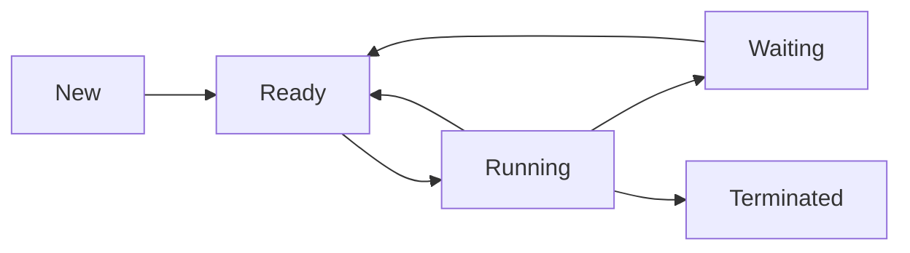

import { Callout, Steps, Step } from "nextra-theme-docs";

# Process States

In operating systems, processes transition through various states during their lifetime. These states define the current condition of a process and determine its behavior within the system. Understanding process states is crucial for effectively managing processes and optimizing system performance.

## The Five Process States

<Steps>
### Step 1: New

When a process is first created, it enters the **New** state. In this state, the process is being initialized and has not yet been admitted to the pool of executable processes by the operating system.

### Step 2: Ready

Once a process is fully initialized and ready to execute, it transitions to the **Ready** state. Processes in the Ready state are waiting to be assigned to a processor. They are loaded into main memory and can be executed at any time.

### Step 3: Running

When a process is selected by the short-term scheduler (also known as the CPU scheduler), it moves from the Ready state to the **Running** state. In this state, the process is actively executing instructions on a processor. At any given time, only one process can be in the Running state per processor core.

### Step 4: Waiting (Blocked)

A process transitions from the Running state to the **Waiting** (or Blocked) state when it needs to wait for an event to occur, such as I/O completion, a signal from another process, or the availability of a resource. While in the Waiting state, the process is not eligible for execution and is temporarily removed from the pool of executable processes.

### Step 5: Terminated

When a process finishes its execution or is forcefully terminated by the operating system, it enters the **Terminated** state. In this state, the process releases all its resources, including memory and open files, and is removed from the pool of executable processes. The operating system performs cleanup activities before completely removing the process from the system.
</Steps>

<Callout type="info" emoji="ℹ️">
It's important to note that not all processes go through every state. For example, a process may transition directly from the New state to the Ready state if there are no initialization delays, or it may transition from the Running state directly to the Terminated state if it completes execution without any waiting periods.
</Callout>

## Process State Transitions

The following diagram illustrates the possible transitions between process states:

Processes can move between states based on various events and scheduling decisions made by the operating system. The operating system maintains a process control block (PCB) for each process, which contains information about the process's state, program counter, CPU registers, and other relevant data.

For a more detailed explanation of process scheduling and the role of schedulers, refer to the [CPU Scheduling](/hardware-resources/cpu/cpu-scheduling) section.

By efficiently managing process states and transitions, the operating system ensures smooth execution, fair resource allocation, and optimal system performance. It allows multiple processes to coexist and share system resources effectively.

## Examples

Here are a few examples of process state transitions:

1. When you launch a web browser, it starts as a new process, transitions to the Ready state, and then moves to the Running state when the operating system assigns it to a processor.

2. If a process requests data from a file, it may transition from the Running state to the Waiting state until the I/O operation is complete. Once the data is available, the process moves back to the Ready state, waiting to be scheduled for execution again.

3. When you close an application, the associated process transitions from the Running state to the Terminated state, and the operating system performs necessary cleanup tasks.

Understanding process states is essential for developers and system administrators to optimize resource utilization, troubleshoot performance issues, and design efficient software systems.

For more information on related topics, explore the following sections:
- [Process Concept](/process-management/processes/process-concept)
- [Process Management Techniques](/process-management/process-management-techniques)