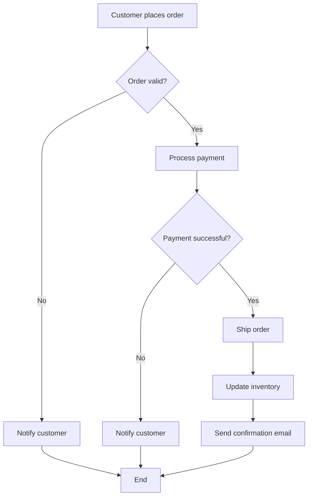
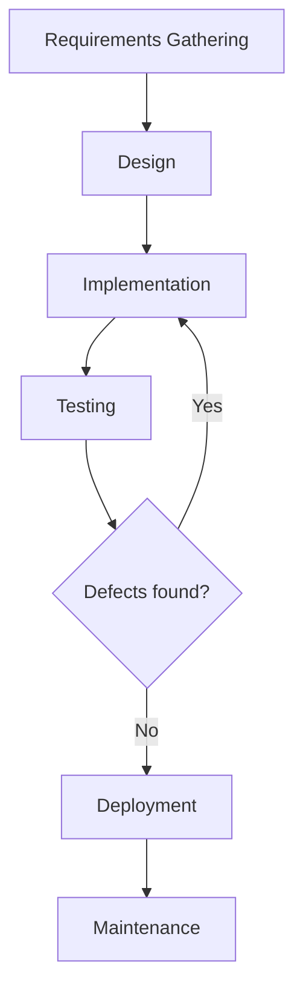
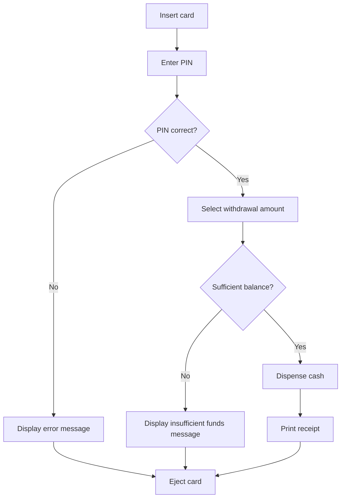

import { Callout, Steps, Step } from "nextra-theme-docs";

# Examples

UML activity diagrams are versatile tools for modeling various processes, from simple workflows to complex systems. Let's explore a few examples to demonstrate their practical applications.

## Example 1: Order Processing

Consider an e-commerce website that processes customer orders. The following activity diagram illustrates the steps involved in the order processing workflow.

In this example, the activity diagram clearly depicts the sequence of actions and decision points involved in processing a customer's order. It starts with the customer placing an order and ends with either a successful order shipment or a notification to the customer about an invalid order or unsuccessful payment.

## Example 2: Software Development Lifecycle

UML activity diagrams can also be used to model the software development lifecycle (SDLC). Here's an example of an activity diagram representing the basic phases of the SDLC:

This diagram provides a high-level overview of the SDLC, starting from requirements gathering and progressing through design, implementation, testing, and deployment. The decision point after the testing phase determines whether the software needs to go back to the implementation phase for defect fixing or can proceed to deployment.

<Callout type="info">
Activity diagrams can be further enhanced with swimlanes to represent the responsibilities of different teams or individuals involved in the SDLC process.
</Callout>

## Example 3: ATM Withdrawal

Let's consider a simple example of an ATM withdrawal process modeled using a UML activity diagram.

This activity diagram illustrates the steps a user goes through when withdrawing cash from an ATM. It includes decision points to validate the PIN and check the account balance, as well as actions such as dispensing cash and printing a receipt.

These examples demonstrate how UML activity diagrams can be applied to various domains, from business processes to software development and everyday scenarios. By visually representing the flow of activities and decision points, activity diagrams provide a clear and concise way to communicate and understand complex processes.

To learn more about the notation and elements used in UML activity diagrams, refer to the [Notation](/uml-and-use-cases/uml-activity-diagrams/notation) subsection.