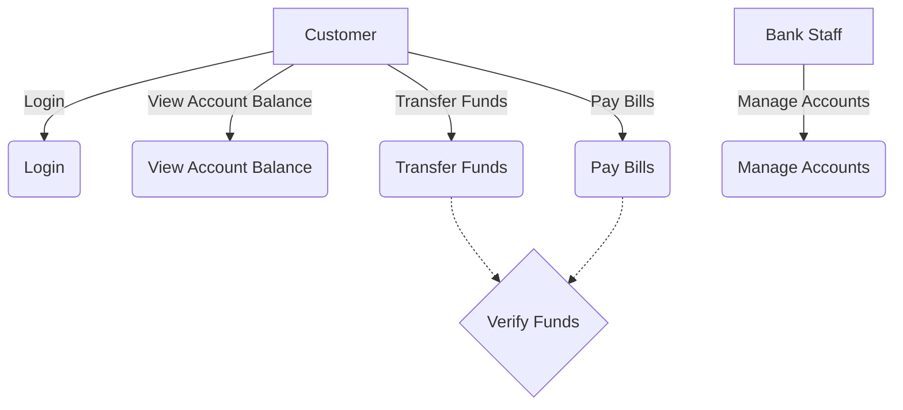

import { Callout, Steps, Step } from "nextra-theme-docs";

# Use Case Diagrams

Use case diagrams are a key component of the Unified Modeling Language (UML) and play a crucial role in visualizing the functionality of a system. They provide a high-level overview of the interactions between actors (users or external systems) and the system itself, representing the goals and requirements of the system from the users' perspective.

## What are Use Case Diagrams?

A use case diagram is a graphical representation of a system's behavior, depicting the system as a black box and showing how it interacts with external entities (actors) to achieve specific goals. It illustrates the functional requirements of the system, capturing the essential features and omitting the details of implementation.

The main elements of a use case diagram are:
- **Actors**: Represented by stick figures, actors are the users or external systems that interact with the system being modeled.
- **Use Cases**: Depicted as ovals, use cases represent the specific functionality or goals that the system must provide to the actors.
- **Relationships**: Lines connecting actors to use cases, indicating the interactions between them. These relationships can be further classified as associations, includes, extends, or generalizations.

<Callout type="info">
Use case diagrams focus on the "what" of the system rather than the "how," emphasizing the system's behavior from the users' point of view.
</Callout>

## Creating a Use Case Diagram

To create a use case diagram, follow these steps:

<Steps>
### Step 1: Identify the actors
Determine the users or external systems that will interact with the system being modeled. These actors can be human users, other software systems, or hardware devices.

### Step 2: Identify the use cases
Identify the main goals or functionalities that the system must provide to the actors. Each use case should represent a specific, observable result that is of value to the actor.

### Step 3: Establish the relationships
Connect the actors to the use cases using lines to represent the interactions between them. Use the appropriate relationship types (association, include, extend, or generalization) to accurately depict the system's behavior.

### Step 4: Refine and iterate
Review the use case diagram, refine the relationships, and iterate the process as needed to ensure that the diagram accurately represents the system's functionality and meets the users' requirements.
</Steps>

## Example Use Case Diagram

Consider an online banking system where customers can perform various financial transactions. The use case diagram for this system might look like this:

In this example, the actors are the Customer and the Bank Staff, and the use cases include Login, View Account Balance, Transfer Funds, Pay Bills, and Manage Accounts. The "Verify Funds" use case is included by both the "Transfer Funds" and "Pay Bills" use cases, indicating that it is a common functionality shared by these two use cases.

By creating a use case diagram, you can effectively communicate the system's requirements and functionalities to stakeholders, developers, and users, ensuring that everyone has a clear understanding of what the system should do.

For more information on other aspects of UML and use cases, check out the following sections:
- [UML Activity Diagrams](/uml-and-use-cases/uml-activity-diagrams)
- [Use Case Specifications](/uml-and-use-cases/use-cases/use-case-specifications)