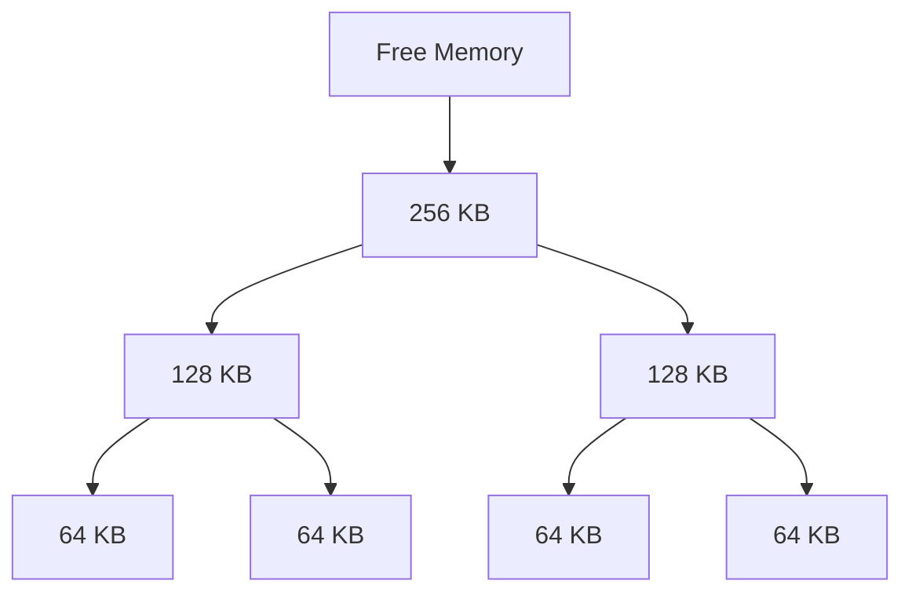

import { Callout, Steps, Step } from "nextra-theme-docs";

# Memory Allocation Algorithms

Dynamic memory allocation is a crucial aspect of operating systems, allowing processes to request and release memory during runtime. Various memory allocation algorithms are employed to efficiently manage the heap memory and minimize fragmentation. In this section, we will explore some of the popular memory allocation algorithms used in operating systems.

## First-Fit Algorithm

The first-fit algorithm is a simple and straightforward approach to memory allocation. It works as follows:

<Steps>
### Step 1

The algorithm starts by searching the free memory list for the first block that is large enough to accommodate the requested memory size.

### Step 2

If a suitable block is found, the requested memory is allocated from the beginning of that block.

### Step 3

If the allocated block is larger than the requested size, the remaining portion is split into a new free block and added back to the free memory list.
</Steps>

The first-fit algorithm is easy to implement and has low overhead. However, it tends to suffer from external fragmentation, as small memory blocks are scattered throughout the heap.

## Best-Fit Algorithm

The best-fit algorithm aims to minimize the amount of wasted memory by finding the smallest block that is large enough to satisfy the memory request. Here's how it works:

<Steps>
### Step 1

The algorithm searches the entire free memory list to find the smallest block that can accommodate the requested memory size.

### Step 2

If a suitable block is found, the requested memory is allocated from that block.

### Step 3

If the allocated block is larger than the requested size, the remaining portion is split into a new free block and added back to the free memory list.
</Steps>

The best-fit algorithm tries to optimize memory utilization by minimizing the size of the remaining free blocks. However, it has higher overhead compared to the first-fit algorithm due to the need to search the entire free memory list.

<Callout type="info">
Both the first-fit and best-fit algorithms can lead to external fragmentation over time, as small free blocks accumulate in the heap.
</Callout>

## Buddy System

The buddy system is a memory allocation algorithm that uses a tree-like structure to manage free memory blocks. It works by dividing memory into fixed-size blocks called "buddies" and allocating them based on the requested size.

In the buddy system, when a memory block is freed, it is merged with its buddy (adjacent block of the same size) if the buddy is also free. This process continues recursively until no more merging is possible. The buddy system helps in reducing external fragmentation by allowing easy coalescing of free blocks.

## Slab Allocation

Slab allocation is a memory allocation algorithm commonly used in kernel memory management. It is designed to efficiently allocate and deallocate objects of the same size. Here's how it works:

<Steps>
### Step 1

The kernel pre-allocates large chunks of memory called "slabs" for commonly used objects such as process descriptors, file descriptors, and network buffers.

### Step 2

Each slab is divided into smaller chunks called "buffers" or "cache entries," which are the actual objects being allocated.

### Step 3

When an object is requested, the slab allocator finds the appropriate slab cache and allocates a free buffer from it.

### Step 4

When an object is freed, it is returned to the corresponding slab cache for future reuse.
</Steps>

Slab allocation minimizes memory fragmentation and provides fast allocation and deallocation of objects since the memory is pre-allocated and no searching is required.

<Callout type="info">
The Linux kernel uses the slab allocator for efficient management of kernel objects. It maintains separate slab caches for different object types, such as `mm_struct` for memory descriptors and `task_struct` for process descriptors.
</Callout>

These memory allocation algorithms play a crucial role in managing the dynamic memory needs of processes in operating systems. Each algorithm has its own trade-offs in terms of performance, fragmentation, and implementation complexity. Understanding these algorithms helps in designing efficient and robust memory management systems.

For more information on memory management in operating systems, you can refer to the following sections:
- [Memory Resources](/memory-resources-and-paging/memory-resources)
- [Virtual Memory](/memory-resources-and-paging/memory-resources/virtual-memory)
- [Paging](/memory-resources-and-paging/paging)