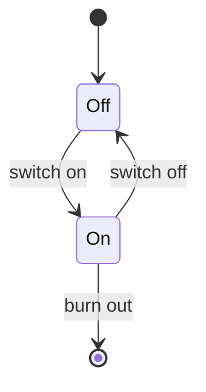

import { Callout, Steps, Step } from "nextra-theme-docs";

# UML State Diagrams

UML state diagrams are a powerful tool for modeling the behavior of a system or an object. They provide a visual representation of the different states an object can be in and the transitions between those states. State diagrams are particularly useful for describing the lifecycle of an object, from its creation to its destruction.

## What are UML State Diagrams?

UML state diagrams, also known as state machine diagrams, are a type of behavioral diagram in the Unified Modeling Language (UML). They show the possible states an object can be in and the events that cause the object to transition from one state to another. State diagrams are commonly used to model the behavior of complex systems, such as embedded systems, user interfaces, and communication protocols.

<Callout type="info">
State diagrams are not limited to modeling the behavior of individual objects. They can also be used to model the behavior of an entire system or a subsystem.
</Callout>

## Elements of a State Diagram

A state diagram consists of the following basic elements:

- **States:** A state represents a condition or a situation during the life of an object. It is denoted by a rounded rectangle with the state name inside it.
- **Transitions:** A transition is a directed arrow that shows the change from one state to another. It is labeled with the event that triggers the transition and any actions that occur during the transition.
- **Initial State:** The initial state is the starting point of the state diagram. It is denoted by a filled circle.
- **Final State:** The final state represents the end of the object's lifecycle. It is denoted by a filled circle inside another circle.

Here's a simple example of a state diagram for a light bulb:

In this diagram, the light bulb has two states: "Off" and "On". The initial state is "Off", and the transitions are triggered by the events "switch on" and "switch off". The final state is reached when the light bulb burns out.

## Benefits of Using State Diagrams

State diagrams offer several benefits in the software development process:

1. **Clarity:** State diagrams provide a clear and concise representation of an object's behavior, making it easier to understand and communicate the system's requirements.
2. **Validation:** By modeling the behavior of an object, state diagrams help in validating the correctness of the system's design and identifying any inconsistencies or missing transitions.
3. **Documentation:** State diagrams serve as a valuable documentation tool, providing a visual reference for the system's behavior that can be easily understood by stakeholders.
4. **Code Generation:** Some UML tools can generate code templates or skeletons based on the state diagrams, saving development time and effort.

## Subsections

To dive deeper into UML state diagrams, explore the following subsections:

- [State Representation](/uml-state-diagrams-and-dynamic-memory-allocation/uml-state-diagrams/state-representation): Learn how states are represented and defined in state diagrams.
- [Transition Representation](/uml-state-diagrams-and-dynamic-memory-allocation/uml-state-diagrams/transition-representation): Understand how transitions between states are modeled and triggered.

By mastering UML state diagrams, you'll be able to effectively model and communicate the behavior of complex systems, leading to more robust and maintainable software designs.