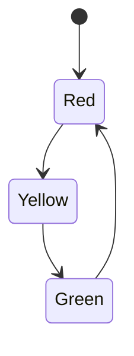
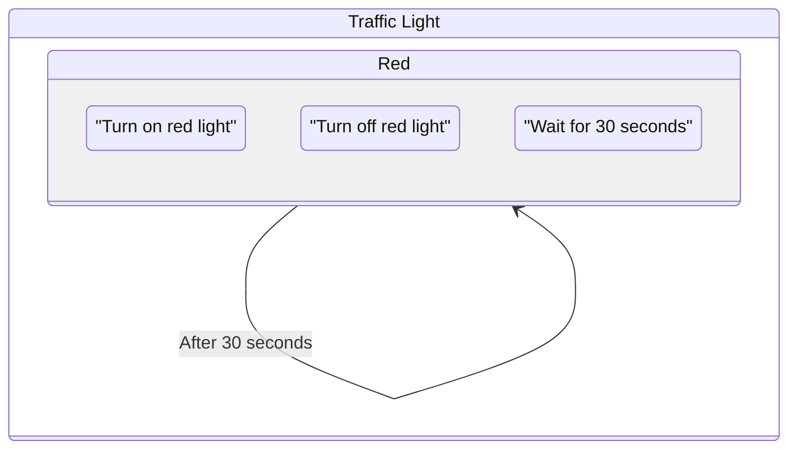
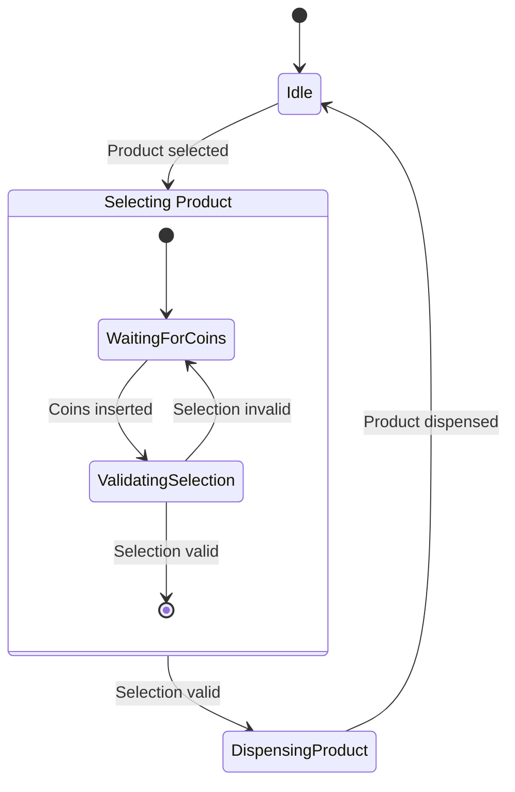

import { Callout, Steps, Step } from "nextra-theme-docs";

# State Representation

In UML state diagrams, states are represented by rounded rectangles with the state name inside. These states capture the different conditions or modes that an object can be in during its lifecycle.

Let's consider an example of a simple traffic light system. The traffic light can be in one of three states: Red, Yellow, or Green.

<Callout type="info">
Each state in a UML state diagram represents a unique configuration or condition of an object at a particular point in time.
</Callout>

## State Notation

The state notation in UML state diagrams consists of three parts:

1. **State Name**: The name of the state, which should be meaningful and describe the condition or mode of the object.
2. **State Activities**: Optional behaviors that are performed while the object is in the state, such as entry actions, exit actions, or do activities.
3. **Internal Transitions**: Optional transitions that occur within the state without causing a change to another state.

Here's an example of a state with all three parts:

In this example, the "Red" state has an entry action (turn on red light), an exit action (turn off red light), a do activity (wait for 30 seconds), and an internal transition that occurs after 30 seconds.

## Hierarchical States

UML state diagrams also support hierarchical states, which allow for the decomposition of complex states into simpler, more manageable substates. This is particularly useful when modeling systems with multiple levels of abstraction or when certain states have common behaviors.

<Steps>

### Step 1: Identify the main states of the system

Begin by identifying the high-level states that the system can be in. For example, in a vending machine, the main states could be "Idle," "Selecting Product," and "Dispensing Product."

### Step 2: Decompose complex states into substates

If any of the main states have complex behaviors or multiple substates, decompose them into hierarchical states. For example, the "Selecting Product" state could have substates for "Waiting for Coins" and "Validating Selection."

### Step 3: Represent hierarchical states in the UML state diagram

Use a nested structure to represent hierarchical states in the UML state diagram. Place substates inside the parent state's rounded rectangle.

</Steps>

Here's an example of a hierarchical state in a vending machine system:

By using state representation techniques like state notation and hierarchical states, you can create clear and comprehensive UML state diagrams that effectively model the dynamic behavior of your system. For more information on other aspects of UML state diagrams, see the [Transition Representation](/uml-state-diagrams-and-dynamic-memory-allocation/uml-state-diagrams/transition-representation) subsection.