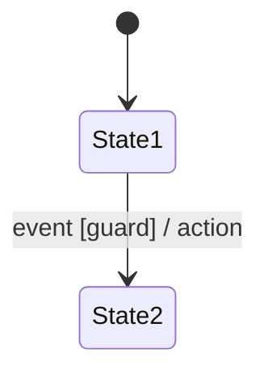
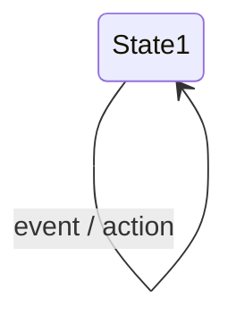
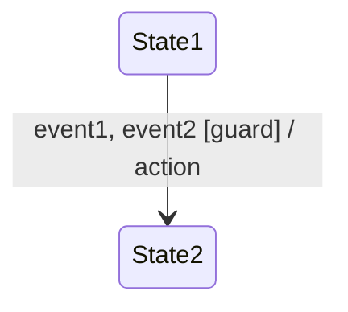
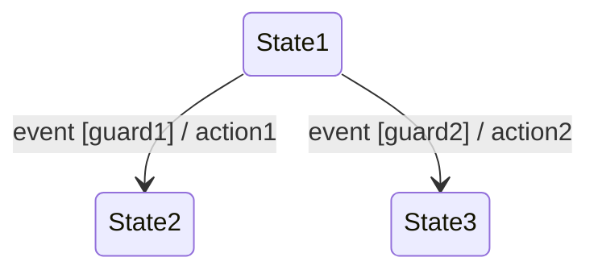

import { Callout, Steps, Step } from "nextra-theme-docs";

# Transition Representation

In UML state diagrams, transitions represent the changes or movements between states in a system. Transitions are triggered by specific events or conditions and can be labeled with various notations to provide additional information about the transition.

## Transition Notation

The basic notation for a transition in a UML state diagram consists of an arrow connecting two states. The arrow is labeled with the triggering event, an optional guard condition, and an optional action.

- **Event**: The triggering event is the occurrence that causes the transition to take place. It can be a signal, a change in a variable's value, or a specific condition being met.

- **Guard**: The guard condition is an optional Boolean expression enclosed in square brackets `[]`. It specifies a condition that must be true for the transition to occur. If the guard condition is not satisfied, the transition will not take place.

- **Action**: The action is an optional behavior that is performed when the transition occurs. It is denoted by a forward slash `/` followed by the action description. Actions can include updating variables, sending signals, or invoking methods.

<Callout type="info">
Transitions can also be labeled with only an event, only a guard, or only an action, depending on the specific requirements of the system being modeled.
</Callout>

## Self-Transitions

A self-transition is a transition that starts and ends at the same state. It represents a situation where an event triggers an action within the state without causing a change to a different state.

## Transitions with Multiple Events

In some cases, a transition may be triggered by multiple events. This can be represented by separating the events with a comma.

## Transitions with Multiple Actions

Transitions can also have multiple actions associated with them. These actions are separated by a semicolon.

```mermaid
stateDiagram-v2
    State1 --> State2: event [guard] / action1; action2
```

## Conditional Transitions

Conditional transitions are used when the target state depends on a specific condition. The conditions are specified using guard expressions, and the transitions are labeled accordingly.

In this example, if `event` occurs and `guard1` is true, the transition from `State1` to `State2` will take place, and `action1` will be executed. If `event` occurs and `guard2` is true, the transition from `State1` to `State3` will occur, and `action2` will be executed.

<Steps>
### Step 1

Identify the states and the events that trigger transitions between them. Determine if any guard conditions or actions are associated with each transition.

### Step 2

Draw the states as rectangles and connect them with arrows representing the transitions. Label the transitions with the appropriate events, guard conditions (in square brackets), and actions (preceded by a forward slash).
</Steps>

By properly representing transitions in UML state diagrams, you can clearly communicate the dynamic behavior of a system and how it responds to various events and conditions. This visual representation helps in understanding and analyzing the system's flow and decision-making processes.

For more information on UML state diagrams, refer to the following sections:
- [UML State Diagrams](/uml-state-diagrams-and-dynamic-memory-allocation/uml-state-diagrams)
- [State Representation](/uml-state-diagrams-and-dynamic-memory-allocation/uml-state-diagrams/state-representation)