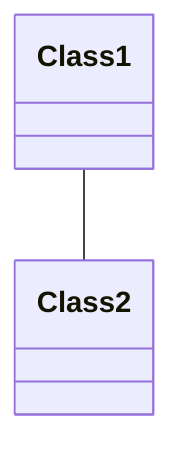
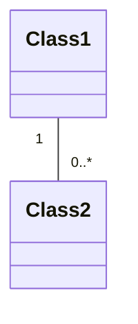
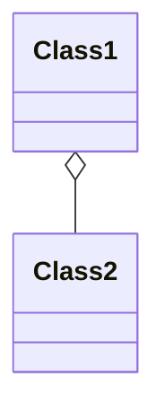
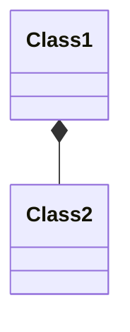
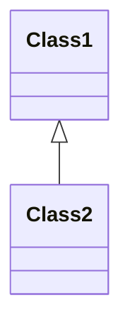

import { Callout, Steps, Step } from "nextra-theme-docs";

# Class Relationships

In UML class diagrams, class relationships are used to represent the connections and associations between classes in a system. These relationships provide a visual representation of how classes interact with each other and how they are structured within the system. Let's explore the different types of class relationships and their notations in UML.

## Association

An association represents a general relationship between two classes, indicating that they are connected in some way. It is depicted by a solid line connecting the two classes.

The multiplicity of an association can be specified at each end of the line, indicating the number of instances of one class that can be associated with instances of the other class. For example, a one-to-many relationship can be represented as follows:

## Aggregation

Aggregation is a special type of association that represents a "has-a" relationship, where one class is a part or component of another class. It is depicted by a hollow diamond at the end of the line connected to the containing class.

In this example, `Class1` has an aggregation relationship with `Class2`, meaning that `Class2` is a part of `Class1`.

<Callout type="info">
Aggregation implies a weaker relationship compared to composition, as the contained class can exist independently of the containing class.
</Callout>

## Composition

Composition is a stronger form of aggregation, representing a "owns-a" relationship. It indicates that the contained class is dependent on the existence of the containing class. Composition is depicted by a filled diamond at the end of the line connected to the containing class.

In this case, `Class1` has a composition relationship with `Class2`, meaning that `Class2` is owned by `Class1` and cannot exist independently.

## Generalization/Inheritance

Generalization, also known as inheritance, represents an "is-a" relationship between classes. It indicates that one class is a specialized version of another class, inheriting its attributes and behaviors. Generalization is depicted by a solid line with a hollow arrowhead pointing from the subclass to the superclass.

Here, `Class2` is a subclass of `Class1`, inheriting its properties and methods.

<Steps>

### Step 1: Identify the classes in your system
Before creating class relationships, identify the key classes that make up your system. Consider the objects and entities that interact with each other and have distinct responsibilities.

### Step 2: Determine the relationships between classes
Analyze how the classes are related to each other. Ask yourself questions like:
- Is one class a part of another class? (Aggregation or Composition)
- Is one class a specialized version of another class? (Generalization/Inheritance)
- Are there any general associations between classes?

### Step 3: Apply the appropriate relationship notations
Based on the identified relationships, use the corresponding UML notations to represent them in your class diagram. Use solid lines for associations, hollow diamonds for aggregation, filled diamonds for composition, and hollow arrowheads for generalization/inheritance.

### Step 4: Specify multiplicity
If necessary, specify the multiplicity of the relationships to indicate the number of instances that can be associated with each other. Use the appropriate notation at each end of the relationship line.

</Steps>

By understanding and utilizing class relationships in UML class diagrams, you can effectively communicate the structure and interactions within your system. It helps in designing a well-organized and maintainable architecture.

For more information on UML class diagrams and their notations, you can refer to the following sections:
- [Class Notation](/user-driven-design-and-uml-class-diagrams/uml-class-diagrams/class-notation)
- [UML Class Diagrams](/user-driven-design-and-uml-class-diagrams/uml-class-diagrams)