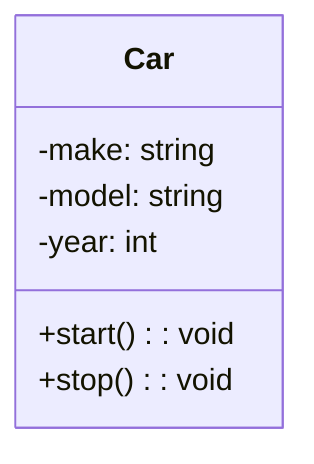

import { Callout, Steps, Step } from "nextra-theme-docs";

# Abstraction

Abstraction is a fundamental concept in object-oriented design that aims to simplify complex systems by hiding unnecessary details and focusing on essential features. It allows developers to create models of real-world objects or systems that capture their core characteristics and behaviors while ignoring the less relevant aspects.

## Benefits of Abstraction

Abstraction offers several benefits in software design and development:

- **Reduced Complexity**: By hiding the internal details of an object or system, abstraction makes it easier to understand and work with complex systems. Developers can focus on the high-level functionality without getting bogged down in the implementation specifics.

- **Modularity**: Abstraction promotes modularity by encapsulating related data and behavior into objects. This modular approach allows for better organization, reusability, and maintainability of code.

- **Flexibility**: Abstracted objects can be easily modified or replaced without affecting the rest of the system. This flexibility enables developers to adapt to changing requirements and evolve the system over time.

## Achieving Abstraction in Object-Oriented Design

Abstraction in object-oriented design is typically achieved through the use of classes and interfaces. Here's how they contribute to abstraction:

### Classes

Classes are the building blocks of object-oriented programming. They define the structure and behavior of objects. By creating classes, you can abstract the common properties and methods of a group of objects into a single entity.



In the example above, the `Car` class abstracts the concept of a car by defining its essential attributes (`make`, `model`, `year`) and behaviors (`start()`, `stop()`). This abstraction allows you to work with cars in your code without worrying about the specific details of each individual car.

### Interfaces

Interfaces define a contract or a set of methods that a class must implement. They provide a higher level of abstraction by specifying the behavior that an object should exhibit without specifying how that behavior should be implemented.

```java
interface Drawable {
    void draw();
}

class Circle implements Drawable {
    @Override
    public void draw() {
        // Implementation for drawing a circle
    }
}

class Rectangle implements Drawable {
    @Override
    public void draw() {
        // Implementation for drawing a rectangle
    }
}
```

In this example, the `Drawable` interface abstracts the concept of an object that can be drawn. Both the `Circle` and `Rectangle` classes implement the `Drawable` interface, providing their own implementation of the `draw()` method. This abstraction allows you to work with objects that can be drawn without knowing the specific details of how each object is drawn.

<Callout type="info">
Abstraction is closely related to other object-oriented principles like [encapsulation](/virtual-memory-and-object-oriented-design/object-oriented-implementations/encapsulation) and [inheritance](/virtual-memory-and-object-oriented-design/object-oriented-design/inheritance). Together, they form the foundation of object-oriented design and enable the creation of modular, reusable, and maintainable code.
</Callout>

By leveraging abstraction in your object-oriented design, you can create clear and understandable models of complex systems, making your code more organized, flexible, and easier to work with.