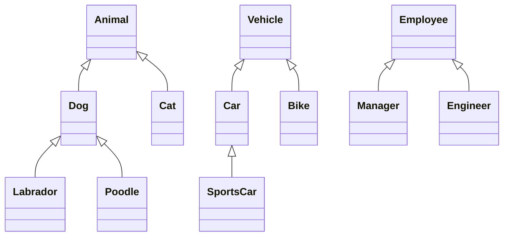

import { Callout, Steps, Step } from "nextra-theme-docs";

# Inheritance

Inheritance is a fundamental concept in object-oriented programming that allows classes to inherit properties and behaviors from other classes. It is a powerful mechanism for code reuse and for creating hierarchical relationships between classes.

## What is Inheritance?

In inheritance, a new class is derived from an existing class, inheriting all of its attributes and methods. The existing class is called the **base class**, **parent class**, or **superclass**, while the new class is called the **derived class**, **child class**, or **subclass**.

The derived class can add new attributes and methods, or override the inherited ones, to extend or specialize the functionality of the base class.

## Benefits of Inheritance

Inheritance provides several benefits in object-oriented design:

- **Code reuse**: Inheritance allows you to reuse the code from the base class in the derived classes, avoiding duplication and promoting code reuse.
- **Modularity**: By organizing classes into hierarchies, inheritance helps in creating modular and maintainable code.
- **Polymorphism**: Inheritance is a prerequisite for polymorphism, which allows objects of different classes to be treated as objects of a common base class.

<Callout type="info">
Inheritance is often referred to as an "is-a" relationship. For example, if a class "Dog" inherits from a class "Animal", we can say that a dog is an animal.
</Callout>

## Types of Inheritance

There are different types of inheritance based on the number of base classes and derived classes involved:

- **Single Inheritance**: A derived class inherits from a single base class.
- **Multiple Inheritance**: A derived class inherits from multiple base classes.
- **Multi-level Inheritance**: A derived class inherits from another derived class, forming a multi-level hierarchy.
- **Hierarchical Inheritance**: Multiple derived classes inherit from a single base class.

Here's a class diagram illustrating the different types of inheritance:



## Implementing Inheritance

To implement inheritance in most object-oriented programming languages, you use the `extends` keyword (or similar) to indicate that a class inherits from another class.

<Steps>
### Step 1: Define the base class

Create a base class with the common attributes and methods that will be inherited by the derived classes.

### Step 2: Define the derived class

Create a derived class using the `extends` keyword and specify the base class it inherits from.

### Step 3: Add specialized attributes and methods

In the derived class, add any additional attributes and methods that are specific to that class.

### Step 4: Override methods (if needed)

If necessary, override the inherited methods in the derived class to provide a specialized implementation.
</Steps>

Here's an example of inheritance in Java:

```java
// Base class
class Animal {
    protected String name;
    
    public void eat() {
        System.out.println("Animal is eating.");
    }
}

// Derived class
class Dog extends Animal {
    private String breed;
    
    public void bark() {
        System.out.println("Dog is barking.");
    }
}
```

In this example, the `Dog` class inherits the `name` attribute and the `eat()` method from the `Animal` class. It also adds a new attribute `breed` and a new method `bark()` specific to dogs.

## Conclusion

Inheritance is a powerful feature of object-oriented programming that allows classes to inherit attributes and methods from other classes. It promotes code reuse, modularity, and polymorphism. By creating hierarchical relationships between classes, inheritance helps in designing more organized and maintainable code.

For more information on object-oriented design principles, you can refer to the following sections:
- [Abstraction](/virtual-memory-and-object-oriented-design/object-oriented-design/abstraction)
- [Polymorphism](/object-oriented-implementations-and-page-replacement/object-oriented-implementations/polymorphism)