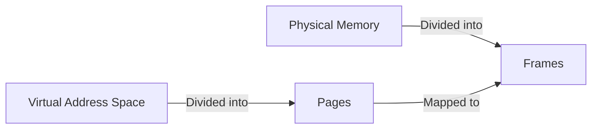

import { Callout, Steps, Step } from "nextra-theme-docs";

# Virtual Memory

Virtual memory is a memory management technique used by operating systems to provide each process with its own large, contiguous address space called **virtual address space**. It allows processes to access memory beyond the limits of the available physical memory (RAM) by using disk space as an extension of the RAM.

The main idea behind virtual memory is to separate the memory addresses used by a process (virtual addresses) from the actual physical addresses in the RAM. This separation provides several benefits:

- Processes can have a larger address space than the physical memory available in the system.
- Multiple processes can share the same physical memory without interfering with each other.
- Processes can be isolated from each other, enhancing security and stability.

<Callout type="info">
Virtual memory is an essential component of modern operating systems, enabling efficient memory utilization and process isolation.
</Callout>

The virtual memory system is implemented using a combination of hardware and software components:

- **MMU (Memory Management Unit)**: A hardware component that translates virtual addresses to physical addresses.
- **Page Tables**: Data structures that store the mapping between virtual and physical addresses.
- **Operating System**: Responsible for managing the page tables and handling page faults.

The virtual address space is divided into fixed-size units called **pages**, while the physical memory is divided into **frames** of the same size. The mapping between pages and frames is stored in the page tables.

When a process accesses a memory location using a virtual address, the MMU translates it to the corresponding physical address using the page tables. If the requested page is not currently in the physical memory (a situation called a **page fault**), the operating system intervenes and loads the required page from the disk into a free frame in the RAM.

The virtual memory system also allows the operating system to swap out infrequently used pages to disk, freeing up physical memory for other processes. This process is called **swapping** or **paging**.

Some key concepts related to virtual memory include:

- [Address Translation](/virtual-memory-and-object-oriented-design/virtual-memory/address-translation): The process of translating virtual addresses to physical addresses.
- [Demand Paging](/virtual-memory-and-object-oriented-design/virtual-memory/demand-paging): A technique that loads pages into memory only when they are requested by a process.

Virtual memory, combined with [paging](/memory-resources-and-paging/paging) and [memory protection](/memory-protection-and-page-tables/memory-protection), enables efficient utilization of system memory and enhances the overall performance and security of the operating system.