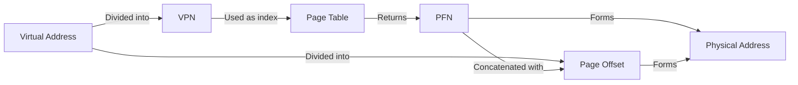

import { Callout, Steps, Step } from "nextra-theme-docs";

# Address Translation

Address translation is the process of converting virtual addresses used by programs into physical addresses that correspond to actual locations in the computer's memory. In a virtual memory system, each program operates in its own virtual address space, which is mapped to the physical memory by the operating system.

## Virtual Addresses

In a virtual memory system, each program is given a contiguous virtual address space, which starts at address 0 and extends to the maximum address allowed by the system's architecture. For example, in a 32-bit system, the virtual address space ranges from 0 to 2^32 - 1 (4 GB).

<Callout type="info">
Virtual addresses are used by programs to reference memory, but they do not directly correspond to physical memory locations.
</Callout>

## Physical Addresses

Physical addresses refer to the actual locations in the computer's main memory (RAM). The size of the physical address space depends on the amount of RAM installed in the system.

## Page Tables

The operating system maintains a data structure called a page table for each process. The page table is used to map virtual addresses to physical addresses. It contains entries that specify the mapping between virtual page numbers and physical page frames.

<Steps>
### Step 1: Virtual Address Division

The virtual address is divided into two parts:
- Virtual Page Number (VPN): The high-order bits of the virtual address that identify the page in the virtual address space.
- Page Offset: The low-order bits of the virtual address that identify the specific location within the page.

### Step 2: Page Table Lookup

The Virtual Page Number (VPN) is used as an index into the process's page table. The page table entry (PTE) at that index contains the corresponding physical page frame number (PFN).

### Step 3: Physical Address Computation

The physical address is computed by concatenating the Physical Page Frame Number (PFN) obtained from the page table with the Page Offset from the virtual address.

</Steps>

The address translation process can be summarized using the following equation:

$Physical Address = (PFN × Page Size) + Page Offset$

## Translation Lookaside Buffer (TLB)

To speed up the address translation process, modern processors include a hardware cache called the Translation Lookaside Buffer (TLB). The TLB stores recently used page table entries, allowing the processor to quickly translate virtual addresses to physical addresses without having to access the main memory-resident page table.

For more information on the TLB, see the [Translation Lookaside Buffer (TLB)](/memory-protection-and-page-tables/page-tables/translation-lookaside-buffer) section.

By utilizing virtual memory and address translation, operating systems provide each process with its own isolated virtual address space, enhancing security and simplifying memory management. This abstraction allows multiple processes to coexist in memory without interfering with each other, and it enables the system to efficiently manage memory resources.