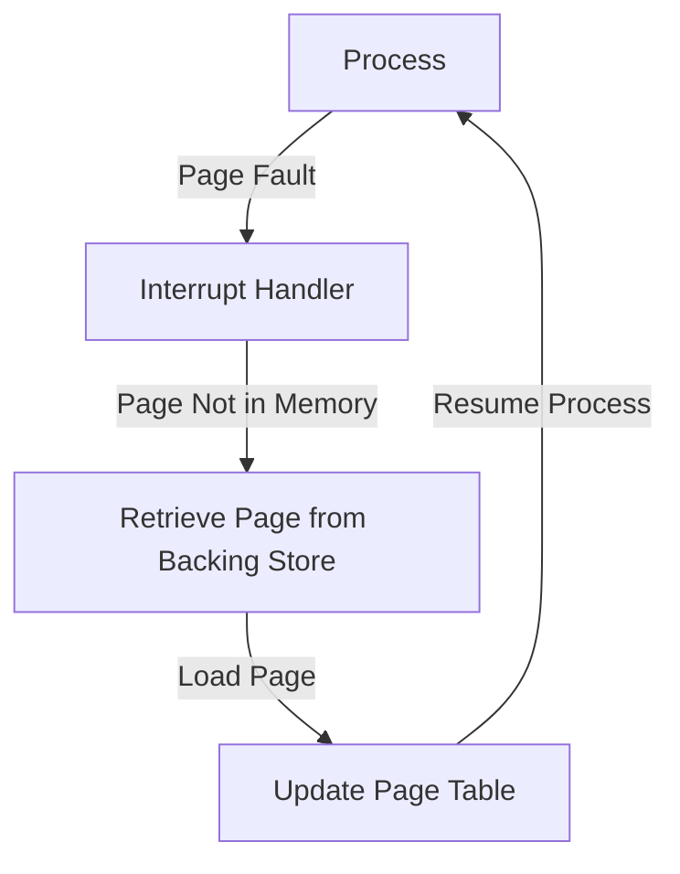

import { Callout, Steps, Step } from "nextra-theme-docs";

# Demand Paging

Demand paging is a memory management technique used in operating systems to optimize memory utilization. It is a key component of virtual memory implementation and plays a crucial role in enhancing system performance.

## What is Demand Paging?

In demand paging, the operating system loads pages of a process into memory only when they are needed, rather than loading the entire process into memory at once. This approach allows the system to run processes that require more memory than is physically available.

The main idea behind demand paging is to:
- Load pages into memory only when they are accessed
- Swap out pages that are not currently in use to make room for new pages

## How Does Demand Paging Work?

<Steps>

### Step 1: Page Fault

When a process attempts to access a page that is not currently in memory, it triggers a *page fault*. The page fault is an exception raised by the hardware, indicating that the requested page is not in physical memory.

### Step 2: Interrupt Handling

The operating system's interrupt handler is invoked to handle the page fault. It determines the cause of the fault and takes appropriate action.

### Step 3: Page Loading

If the page fault occurred because the requested page is not in memory, the operating system retrieves the page from the backing store (usually a hard disk) and loads it into an available page frame in physical memory.

### Step 4: Page Table Update

The operating system updates the page table to reflect the new mapping between the virtual page and the physical page frame. It sets the *present bit* to indicate that the page is now in memory.

### Step 5: Process Resumption

Once the page is loaded and the page table is updated, the operating system resumes the execution of the process from the instruction that caused the page fault.

</Steps>

The following diagram illustrates the demand paging process:

## Advantages of Demand Paging

Demand paging offers several benefits:

- **Efficient Memory Utilization**: By loading pages only when they are needed, demand paging optimizes memory usage and allows more processes to run concurrently.
- **Faster Process Startup**: Since the entire process is not loaded into memory at once, the process startup time is reduced.
- **Increased Multiprogramming**: Demand paging enables higher degrees of multiprogramming by allowing more processes to fit in memory simultaneously.

<Callout type="info">
Demand paging is often used in conjunction with other memory management techniques, such as [page replacement](/virtual-memory-and-object-oriented-design/virtual-memory/page-replacement), to handle situations when there are no free page frames available in memory.
</Callout>

## Conclusion

Demand paging is a powerful memory management technique that optimizes memory utilization and enhances system performance. By loading pages into memory only when they are needed and swapping out unused pages, demand paging enables efficient memory usage and supports higher degrees of multiprogramming.